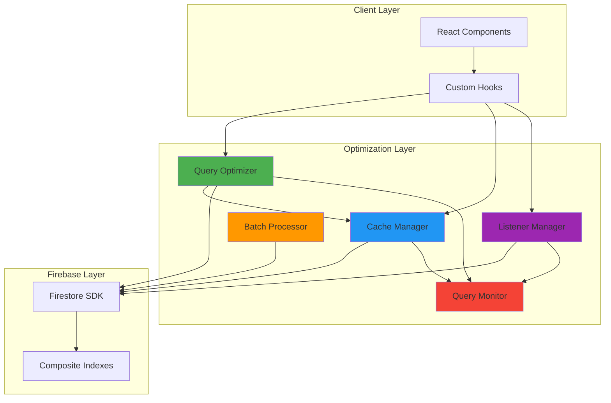
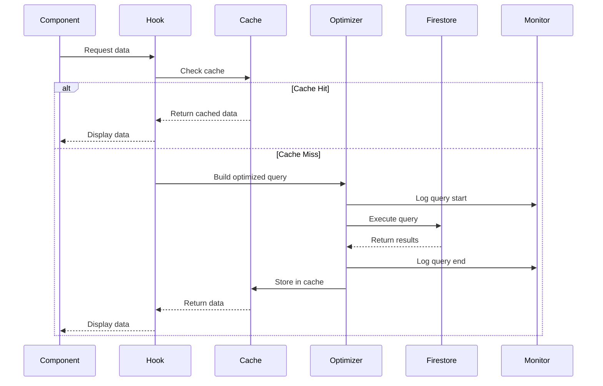

# Design Document - Firestore Query Optimization

## Overview

Tính năng Firestore Query Optimization nhằm tối ưu hóa toàn diện các truy vấn Firestore trong TVU Connect, giảm thiểu document reads, cải thiện hiệu suất, và giảm chi phí vận hành. Hệ thống bao gồm 5 thành phần chính:

1. **Query Optimizer**: Tối ưu hóa cấu trúc queries với limits, indexes, và filters
2. **Cache Manager**: Quản lý in-memory cache với TTL và LRU eviction
3. **Batch Processor**: Gộp write operations để giảm số lượng writes
4. **Real-Time Listener Manager**: Quản lý và tối ưu snapshot listeners
5. **Query Monitor**: Giám sát hiệu suất và chi phí queries

Mục tiêu chính:
- Giảm 50% tổng chi phí Firestore
- Giảm 40-70% document reads tùy theo từng module
- Cải thiện tốc độ load dữ liệu 2-3 lần
- Tối ưu real-time listeners để giảm snapshot reads

## Architecture

### System Architecture Diagram



### Data Flow Architecture



### Module Architecture

Hệ thống được chia thành các modules độc lập:

1. **Posts Optimization Module**
   - Pagination với limit 10
   - Cache 60 seconds
   - Real-time updates cho new posts only
   - Filter posts > 18 hours at database level

2. **Matching Optimization Module**
   - Limit 50 profiles per query
   - Cache viewed profiles 24 hours
   - In-memory filtering cho already shown UIDs
   - Batch save match history (10 records/batch)

3. **Messages Optimization Module**
   - Limit 20 conversations, 30 messages
   - Cache conversations 120 seconds
   - Single active listener per conversation
   - Auto-unsubscribe on conversation switch

4. **Places Optimization Module**
   - Adaptive limits (100 mobile, 200 desktop)
   - Cache 300 seconds
   - Filter expired check-ins at database
   - Limit check-ins (30 mobile, 50 desktop)

5. **Profiles Optimization Module**
   - Cache 180 seconds
   - Batch fetch blocked users
   - Composite index for favorites lookup

6. **Online Status Optimization Module**
   - Cache 30 seconds per user
   - Listener reuse and deduplication
   - Auto-cleanup on unmount

## Components and Interfaces

### 1. Query Optimizer Component

```typescript
interface QueryOptimizerConfig {
  collection: string;
  limit: number;
  orderBy?: { field: string; direction: 'asc' | 'desc' };
  where?: Array<{ field: string; operator: WhereFilterOp; value: any }>;
  startAfter?: DocumentSnapshot;
  useCache?: boolean;
  cacheTTL?: number;
}

interface QueryResult<T> {
  data: T[];
  lastDoc: DocumentSnapshot | null;
  hasMore: boolean;
  fromCache: boolean;
  executionTime: number;
}

class QueryOptimizer {
  async executeQuery<T>(config: QueryOptimizerConfig): Promise<QueryResult<T>>;
  buildQuery(config: QueryOptimizerConfig): Query;
  applyFilters(query: Query, filters: WhereClause[]): Query;
  applyPagination(query: Query, cursor?: DocumentSnapshot): Query;
}
```

**Responsibilities:**
- Build optimized Firestore queries với limits và indexes
- Apply filters at database level
- Handle pagination với startAfter cursors
- Integrate với Cache Manager
- Log query metrics to Query Monitor

**Key Methods:**
- `executeQuery()`: Execute query với caching và monitoring
- `buildQuery()`: Construct Firestore query từ config
- `applyFilters()`: Apply where clauses
- `applyPagination()`: Add limit và startAfter

### 2. Cache Manager Component

```typescript
interface CacheEntry<T> {
  data: T;
  timestamp: number;
  ttl: number;
  hits: number;
}

interface CacheConfig {
  maxSize: number;
  defaultTTL: number;
  evictionPolicy: 'LRU' | 'LFU';
}

class CacheManager {
  private cache: Map<string, CacheEntry<any>>;
  private config: CacheConfig;
  
  get<T>(key: string): T | null;
  set<T>(key: string, data: T, ttl?: number): void;
  invalidate(key: string): void;
  invalidatePattern(pattern: string): void;
  clear(): void;
  getStats(): CacheStats;
  evictOldest(): void;
}

interface CacheStats {
  size: number;
  hits: number;
  misses: number;
  hitRate: number;
  evictions: number;
}
```

**Responsibilities:**
- Store và retrieve cached data
- Manage TTL và auto-expiration
- Implement LRU eviction khi cache full
- Track cache hit/miss rates
- Invalidate cache khi data updates

**Cache Strategy by Collection:**
- Posts: 60s TTL, max 50 entries
- Conversations: 120s TTL, max 30 entries
- Messages: No cache (real-time)
- Places: 300s TTL, max 100 entries
- Profiles: 180s TTL, max 100 entries
- Online Status: 30s TTL, max 50 entries

### 3. Batch Processor Component

```typescript
interface BatchOperation {
  type: 'set' | 'update' | 'delete';
  ref: DocumentReference;
  data?: any;
}

interface BatchConfig {
  maxBatchSize: number;
  autoFlushInterval: number;
  retryOnFailure: boolean;
}

class BatchProcessor {
  private pendingOps: BatchOperation[];
  private config: BatchConfig;
  
  add(operation: BatchOperation): void;
  flush(): Promise<void>;
  autoFlush(): void;
  clear(): void;
}
```

**Responsibilities:**
- Queue write operations
- Batch operations in groups of 10
- Auto-flush after 500ms or when batch full
- Retry individual operations on batch failure
- Track batch execution metrics

**Use Cases:**
- Match history saves (batch 10 records)
- Account deletion (batch delete all user data)
- Bulk profile updates
- Bulk notification marks as read

### 4. Real-Time Listener Manager Component

```typescript
interface ListenerConfig {
  query: Query;
  onUpdate: (data: any[]) => void;
  onError: (error: Error) => void;
  limit?: number;
}

interface ActiveListener {
  id: string;
  unsubscribe: () => void;
  query: Query;
  subscribers: Set<string>;
  createdAt: number;
}

class ListenerManager {
  private listeners: Map<string, ActiveListener>;
  
  subscribe(id: string, config: ListenerConfig): string;
  unsubscribe(subscriberId: string): void;
  getActiveListeners(): ActiveListener[];
  cleanup(): void;
}
```

**Responsibilities:**
- Manage real-time snapshot listeners
- Prevent duplicate listeners
- Share listeners across components
- Auto-unsubscribe on unmount
- Track active listener count

**Listener Strategy:**
- Messages: 1 listener per active conversation
- Online Status: Reuse listeners, max 15 concurrent
- Posts: 1 listener for new posts only
- Conversations: 1 listener for list updates

### 5. Query Monitor Component

```typescript
interface QueryMetrics {
  queryId: string;
  collection: string;
  executionTime: number;
  documentReads: number;
  fromCache: boolean;
  timestamp: number;
}

interface PerformanceReport {
  totalQueries: number;
  totalReads: number;
  averageExecutionTime: number;
  cacheHitRate: number;
  slowQueries: QueryMetrics[];
  costEstimate: number;
}

class QueryMonitor {
  private metrics: QueryMetrics[];
  
  logQuery(metrics: QueryMetrics): void;
  getReport(): PerformanceReport;
  getSlowQueries(threshold: number): QueryMetrics[];
  getCostEstimate(): number;
  trackDocumentReads(count: number): void;
  alertOnHighUsage(): void;
}
```

**Responsibilities:**
- Log all query executions
- Track document reads
- Calculate execution times
- Generate performance reports
- Alert on slow queries (>2s)
- Estimate daily costs

**Monitoring Metrics:**
- Query execution time
- Document reads per query
- Cache hit rate
- Total daily reads
- Cost per day
- Slow query alerts

### 6. Pagination Handler Component

```typescript
interface PaginationState<T> {
  data: T[];
  lastDoc: DocumentSnapshot | null;
  hasMore: boolean;
  loading: boolean;
  error: Error | null;
}

interface PaginationConfig {
  pageSize: number;
  preloadNext: boolean;
}

class PaginationHandler<T> {
  private state: PaginationState<T>;
  private config: PaginationConfig;
  
  async loadInitial(query: Query): Promise<void>;
  async loadNext(): Promise<void>;
  reset(): void;
  getState(): PaginationState<T>;
}
```

**Responsibilities:**
- Handle initial page load
- Load next pages với startAfter
- Track last document reference
- Prevent duplicate loads
- Indicate when no more data

**Pagination Limits:**
- Posts: 10 per page
- Conversations: 20 per page
- Messages: 30 per page
- Matching profiles: 50 per page
- Places: 100 (mobile) / 200 (desktop)

## Data Models

### Cache Entry Model

```typescript
interface CacheEntry<T> {
  data: T;              // Cached data
  timestamp: number;    // Unix timestamp khi cache được tạo
  ttl: number;          // Time-to-live in milliseconds
  hits: number;         // Số lần cache được hit
  size?: number;        // Size estimate in bytes
}
```

### Query Metrics Model

```typescript
interface QueryMetrics {
  queryId: string;           // Unique query identifier
  collection: string;        // Firestore collection name
  operation: 'read' | 'write' | 'listen';
  executionTime: number;     // Milliseconds
  documentReads: number;     // Number of documents read
  fromCache: boolean;        // Whether served from cache
  timestamp: number;         // Unix timestamp
  userId?: string;           // User who triggered query
  filters?: string[];        // Applied filters
  limit?: number;            // Query limit
}
```

### Batch Operation Model

```typescript
interface BatchOperation {
  type: 'set' | 'update' | 'delete';
  ref: DocumentReference;
  data?: any;
  retryCount?: number;
  error?: Error;
}
```

### Listener Registry Model

```typescript
interface ListenerRegistryEntry {
  id: string;                    // Unique listener ID
  queryHash: string;             // Hash of query for deduplication
  unsubscribe: () => void;       // Unsubscribe function
  subscribers: Set<string>;      // Component IDs subscribed
  createdAt: number;             // Creation timestamp
  lastActivity: number;          // Last activity timestamp
  documentCount: number;         // Number of documents in snapshot
}
```

### Performance Report Model

```typescript
interface PerformanceReport {
  period: {
    start: number;
    end: number;
  };
  queries: {
    total: number;
    cached: number;
    firestore: number;
  };
  reads: {
    total: number;
    cached: number;
    firestore: number;
  };
  performance: {
    averageExecutionTime: number;
    p50: number;
    p95: number;
    p99: number;
  };
  cache: {
    hitRate: number;
    size: number;
    evictions: number;
  };
  cost: {
    estimatedDaily: number;
    estimatedMonthly: number;
    savingsPercent: number;
  };
  slowQueries: QueryMetrics[];
  topCollections: Array<{
    collection: string;
    reads: number;
    cost: number;
  }>;
}
```

### Composite Index Configuration Model

```typescript
interface CompositeIndex {
  collectionGroup: string;
  queryScope: 'COLLECTION' | 'COLLECTION_GROUP';
  fields: Array<{
    fieldPath: string;
    order?: 'ASCENDING' | 'DESCENDING';
    arrayConfig?: 'CONTAINS';
  }>;
}

interface IndexConfiguration {
  indexes: CompositeIndex[];
  fieldOverrides: Array<{
    collectionGroup: string;
    fieldPath: string;
    indexes: Array<{
      order?: 'ASCENDING' | 'DESCENDING';
      arrayConfig?: 'CONTAINS';
    }>;
  }>;
}
```


## Correctness Properties

*A property is a characteristic or behavior that should hold true across all valid executions of a system-essentially, a formal statement about what the system should do. Properties serve as the bridge between human-readable specifications and machine-verifiable correctness guarantees.*

