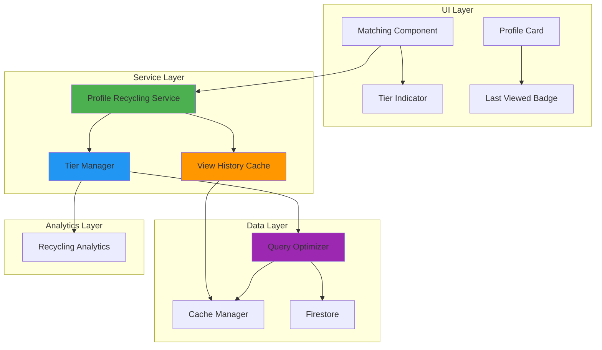
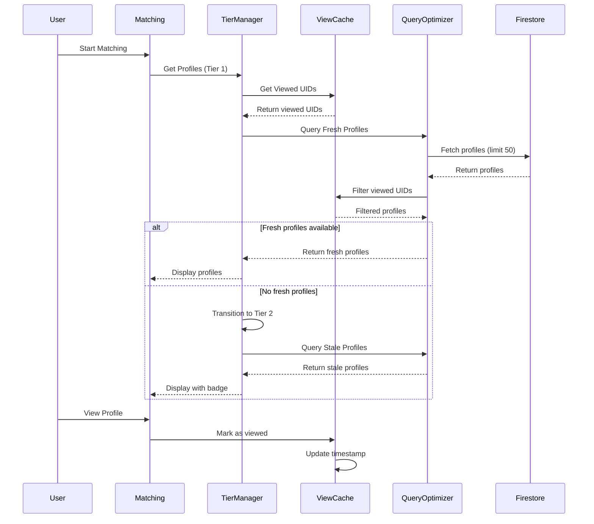

# Design Document - Matching Profile Recycling System

## Overview

Hệ thống Matching Profile Recycling giải quyết vấn đề "hết hồ sơ" trong TVU Connect bằng cách triển khai 3 cấp độ tìm kiếm thông minh: Fresh Profiles (chưa xem), Stale Profiles (đã xem > 7 ngày), và All Profiles (tất cả hồ sơ). Hệ thống tự động chuyển đổi giữa các cấp độ khi hết hồ sơ, hiển thị indicator rõ ràng, và tối ưu Firestore queries để giảm chi phí.

### Key Features

1. **3-Tier Profile System**
   - Fresh Profiles: Hồ sơ chưa từng xem (ưu tiên cao nhất)
   - Stale Profiles: Hồ sơ đã xem > 7 ngày (ưu tiên trung bình)
   - All Profiles: Tất cả hồ sơ đã xem (ưu tiên thấp)

2. **Enhanced View History Cache**
   - Lưu timestamp chi tiết cho mỗi lần xem
   - Track view count cho analytics
   - Persist to localStorage cho cross-session continuity
   - 24-hour TTL với auto-cleanup entries > 30 days

3. **Automatic Tier Transition**
   - Tự động chuyển tier khi hết hồ sơ
   - Smooth animation transitions (< 1 second)
   - Analytics tracking cho tier changes

4. **Smart UI Indicators**
   - Tier Indicator: Hiển thị cấp độ hiện tại với icon và màu sắc
   - Last Viewed Badge: Hiển thị thời gian xem lần cuối
   - Profile count: Số hồ sơ khả dụng trong tier

5. **Firestore Query Optimization**
   - In-memory UID filtering (không query database)
   - Batch fetching với "where uid in array"
   - Tiered cache strategy (60s/300s/600s TTL)
   - Reuse existing composite indexes

### Goals

- **User Experience**: 0% users thấy "no more profiles" message
- **Engagement**: 30% increase in matches per session
- **Performance**: < 2s query time trên 3G network
- **Cost**: Không tăng Firestore reads quá 20% so với baseline


## Architecture

### System Architecture Diagram



### Data Flow Architecture




### Module Architecture

Hệ thống được chia thành các modules độc lập:

1. **Profile Recycling Service Module**
   - Orchestrates tier selection và profile fetching
   - Integrates với Tier Manager và View History Cache
   - Handles tier transitions và analytics tracking

2. **Tier Manager Module**
   - Manages current tier state (Fresh/Stale/All)
   - Checks profile availability per tier
   - Triggers automatic tier transitions
   - Calculates cooldown periods per mode

3. **View History Cache Module**
   - Enhanced version of existing viewedProfilesCache.ts
   - Stores {uid, viewedAt, viewCount} entries
   - Provides getProfilesByAge(minDays) method
   - Persists to localStorage với 30-day cleanup

4. **Tier Indicator Component**
   - Displays current tier với icon và color
   - Shows profile count
   - Animates tier transitions (300ms fade)

5. **Last Viewed Badge Component**
   - Calculates time since last view
   - Formats time string (minutes/hours/days)
   - Conditionally renders based on tier

6. **Recycling Analytics Module**
   - Tracks tier_transition events
   - Tracks profile_recycled_view events
   - Stores in Firestore collection "recycling_analytics"
   - Non-blocking async operations


## Components and Interfaces

### 1. Profile Recycling Service

```typescript
interface ProfileRecyclingConfig {
  mode: 'lover' | 'study' | 'hobby' | 'quick';
  filters: MatchingFilters;
  userId: string;
}

interface RecyclingResult {
  profiles: StudentProfile[];
  tier: 'fresh' | 'stale' | 'all';
  hasMore: boolean;
  totalAvailable: number;
}

class ProfileRecyclingService {
  private tierManager: TierManager;
  private viewHistoryCache: ViewHistoryCache;
  private queryOptimizer: FirestoreQueryOptimizer;
  private analytics: RecyclingAnalytics;
  
  async getProfiles(config: ProfileRecyclingConfig): Promise<RecyclingResult>;
  async markProfileViewed(userId: string, profileId: string): Promise<void>;
  getCurrentTier(): 'fresh' | 'stale' | 'all';
  getTierStats(): TierStats;
}
```

**Responsibilities:**
- Orchestrate profile fetching across tiers
- Coordinate between Tier Manager và View History Cache
- Apply filters và sorting per tier
- Track analytics events
- Handle tier transitions

**Key Methods:**
- `getProfiles()`: Main entry point, returns profiles for current tier
- `markProfileViewed()`: Update view history khi user views profile
- `getCurrentTier()`: Get current tier state
- `getTierStats()`: Get availability counts per tier

### 2. Tier Manager Component

```typescript
interface TierState {
  currentTier: 'fresh' | 'stale' | 'all';
  availableCount: number;
  lastTransition: number;
}

interface TierConfig {
  mode: 'lover' | 'study' | 'hobby' | 'quick';
  cooldownPeriods: {
    lover: number;    // 7 days
    study: number;    // 5 days
    hobby: number;    // 5 days
    quick: number;    // 3 days
  };
}

class TierManager {
  private state: TierState;
  private config: TierConfig;
  
  async checkAvailability(tier: 'fresh' | 'stale' | 'all'): Promise<number>;
  async transitionToNextTier(): Promise<boolean>;
  getCooldownPeriod(mode: string): number;
  shouldTransition(): boolean;
  resetToFresh(): void;
}
```

**Responsibilities:**
- Manage current tier state
- Check profile availability per tier
- Trigger automatic transitions
- Calculate mode-specific cooldown periods
- Reset to Fresh tier on filter changes

**Tier Transition Logic:**
1. Start with Fresh tier
2. If Fresh returns 0 profiles → transition to Stale
3. If Stale returns 0 profiles → transition to All
4. If All returns 0 profiles → show "no profiles" message

**Cooldown Periods:**
- Lover mode: 7 days
- Study/Hobby modes: 5 days
- Quick mode: 3 days


### 3. View History Cache Component (Enhanced)

```typescript
interface ViewHistoryEntry {
  uid: string;
  viewedAt: number;      // Unix timestamp
  viewCount: number;     // Number of times viewed
  mode: string;          // Mode when viewed
}

interface ViewHistoryCacheConfig {
  ttl: number;           // 24 hours
  maxAge: number;        // 30 days for cleanup
  persistToLocalStorage: boolean;
}

class ViewHistoryCache {
  private cacheManager: FirestoreCacheManager;
  private config: ViewHistoryCacheConfig;
  
  getViewedProfiles(userId: string): ViewHistoryEntry[];
  markAsViewed(userId: string, profileId: string, mode: string): void;
  getProfilesByAge(userId: string, minDays: number): ViewHistoryEntry[];
  isInCooldown(entry: ViewHistoryEntry, cooldownDays: number): boolean;
  cleanupOldEntries(userId: string): void;
  getStats(userId: string): ViewHistoryStats;
}

interface ViewHistoryStats {
  total: number;
  inCooldown: number;
  available: number;
  byMode: Record<string, number>;
}
```

**Responsibilities:**
- Store view history với timestamp và view count
- Provide filtering by age (for Stale tier)
- Check cooldown status
- Persist to localStorage
- Auto-cleanup entries > 30 days
- Integration với existing CacheManager

**Key Methods:**
- `getViewedProfiles()`: Get all viewed profiles for user
- `markAsViewed()`: Record profile view với timestamp
- `getProfilesByAge()`: Filter profiles viewed > X days ago
- `isInCooldown()`: Check if profile is in cooldown period
- `cleanupOldEntries()`: Remove entries > 30 days old

**Storage Strategy:**
- In-memory cache: 24-hour TTL
- localStorage: Persistent across sessions
- Cleanup on load: Remove entries > 30 days

### 4. Tier Indicator Component

```typescript
interface TierIndicatorProps {
  tier: 'fresh' | 'stale' | 'all';
  availableCount: number;
  isTransitioning: boolean;
}

const TierIndicator: React.FC<TierIndicatorProps> = ({
  tier,
  availableCount,
  isTransitioning
}) => {
  // Render tier badge with icon, color, and count
}
```

**Responsibilities:**
- Display current tier với appropriate styling
- Show profile count
- Animate transitions (300ms fade)
- Responsive design (mobile + desktop)

**Visual Design:**
- Fresh tier: 🆕 "Hồ sơ mới" - Green (#4CAF50)
- Stale tier: 🔄 "Xem lại (>7 ngày)" - Orange (#FF9800)
- All tier: ♻️ "Tất cả hồ sơ" - Blue (#2196F3)
- Count text: "X hồ sơ khả dụng"

**Animation:**
- Fade out current tier (200ms)
- Show loading indicator (300ms)
- Fade in new tier (200ms)
- Total transition: < 1 second


### 5. Last Viewed Badge Component

```typescript
interface LastViewedBadgeProps {
  viewedAt: number;      // Unix timestamp
  tier: 'fresh' | 'stale' | 'all';
}

const LastViewedBadge: React.FC<LastViewedBadgeProps> = ({
  viewedAt,
  tier
}) => {
  const timeText = formatTimeAgo(viewedAt);
  
  if (tier === 'fresh') return null;
  
  return (
    <div className="last-viewed-badge">
      <span>👁️</span>
      <span>{timeText}</span>
    </div>
  );
}

function formatTimeAgo(timestamp: number): string {
  const now = Date.now();
  const diff = now - timestamp;
  
  const minutes = Math.floor(diff / (60 * 1000));
  const hours = Math.floor(diff / (60 * 60 * 1000));
  const days = Math.floor(diff / (24 * 60 * 60 * 1000));
  
  if (minutes < 60) {
    return `Đã xem lần cuối: ${minutes} phút trước`;
  } else if (hours < 24) {
    return `Đã xem lần cuối: ${hours} giờ trước`;
  } else {
    return `Đã xem lần cuối: ${days} ngày trước`;
  }
}
```

**Responsibilities:**
- Calculate time since last view
- Format time string appropriately
- Conditionally render based on tier
- Responsive design

**Display Rules:**
- Fresh tier: No badge (never shown)
- Stale tier: Always show badge
- All tier: Always show badge

**Time Formatting:**
- < 1 hour: "X phút trước"
- < 24 hours: "X giờ trước"
- >= 24 hours: "X ngày trước"

**Visual Design:**
- Position: Top-right of profile card
- Background: Gray (#757575)
- Text: White
- Icon: 👁️
- Font size: 12px (mobile), 14px (desktop)

### 6. Recycling Analytics Component

```typescript
interface RecyclingAnalyticsEvent {
  eventType: 'tier_transition' | 'profile_recycled_view';
  userId: string;
  timestamp: Timestamp;
  metadata: {
    fromTier?: string;
    toTier?: string;
    mode?: string;
    profileId?: string;
    daysSinceLastView?: number;
  };
}

class RecyclingAnalytics {
  async trackTierTransition(
    userId: string,
    fromTier: string,
    toTier: string,
    mode: string
  ): Promise<void>;
  
  async trackProfileRecycledView(
    userId: string,
    profileId: string,
    daysSinceLastView: number,
    mode: string
  ): Promise<void>;
  
  async getMetrics(userId: string): Promise<RecyclingMetrics>;
}

interface RecyclingMetrics {
  totalTransitions: number;
  tier2ReachRate: number;    // % users reaching Stale tier
  tier3ReachRate: number;    // % users reaching All tier
  avgTimePerTier: Record<string, number>;
  recycledViewCount: number;
}
```

**Responsibilities:**
- Track tier transition events
- Track recycled profile views
- Store events in Firestore
- Non-blocking async operations
- Generate metrics reports

**Event Storage:**
- Collection: `recycling_analytics`
- Document structure: Auto-generated ID
- Indexes: userId + timestamp, eventType + timestamp

**Analytics Goals:**
- Track tier 2 reach rate (target: measure baseline)
- Track tier 3 reach rate (target: measure baseline)
- Track average time spent per tier
- Track recycled view engagement


## Data Models

### ViewHistoryEntry Model

```typescript
interface ViewHistoryEntry {
  uid: string;           // Profile UID
  viewedAt: number;      // Unix timestamp of last view
  viewCount: number;     // Total number of times viewed
  mode: string;          // Mode when last viewed (lover/study/hobby/quick)
}
```

**Storage:**
- In-memory cache: Map<userId, ViewHistoryEntry[]>
- localStorage key: `tvu_viewed_profiles_${userId}`
- TTL: 24 hours in cache
- Cleanup: Remove entries > 30 days on load

### TierState Model

```typescript
interface TierState {
  currentTier: 'fresh' | 'stale' | 'all';
  availableCount: number;        // Profiles available in current tier
  lastTransition: number;        // Timestamp of last tier change
  transitionHistory: string[];   // History of tier changes in session
}
```

**State Management:**
- Stored in React state (Matching component)
- Reset to 'fresh' on filter changes
- Reset to 'fresh' on mode changes

### RecyclingAnalyticsEvent Model

```typescript
interface RecyclingAnalyticsEvent {
  eventType: 'tier_transition' | 'profile_recycled_view';
  userId: string;
  timestamp: Timestamp;
  metadata: {
    // For tier_transition events
    fromTier?: 'fresh' | 'stale' | 'all';
    toTier?: 'fresh' | 'stale' | 'all';
    mode?: 'lover' | 'study' | 'hobby' | 'quick';
    
    // For profile_recycled_view events
    profileId?: string;
    daysSinceLastView?: number;
    tier?: 'stale' | 'all';
  };
}
```

**Firestore Collection: `recycling_analytics`**

**Indexes Required:**
```json
{
  "collectionGroup": "recycling_analytics",
  "queryScope": "COLLECTION",
  "fields": [
    { "fieldPath": "userId", "order": "ASCENDING" },
    { "fieldPath": "timestamp", "order": "DESCENDING" }
  ]
},
{
  "collectionGroup": "recycling_analytics",
  "queryScope": "COLLECTION",
  "fields": [
    { "fieldPath": "eventType", "order": "ASCENDING" },
    { "fieldPath": "timestamp", "order": "DESCENDING" }
  ]
}
```

### CacheKey Model

```typescript
interface CacheKeyComponents {
  tier: 'fresh' | 'stale' | 'all';
  mode: 'lover' | 'study' | 'hobby' | 'quick';
  filterHash: string;    // MD5 hash of filter values
}

function generateCacheKey(components: CacheKeyComponents): string {
  return `tier:${components.tier}:mode:${components.mode}:filters:${components.filterHash}`;
}
```

**Cache Key Format:**
- `tier:fresh:mode:lover:filters:abc123`
- `tier:stale:mode:study:filters:def456`
- `tier:all:mode:quick:filters:ghi789`

**Filter Hash Calculation:**
```typescript
function calculateFilterHash(filters: MatchingFilters): string {
  const filterString = JSON.stringify({
    gender: filters.gender,
    major: filters.major,
    academicYear: filters.academicYear,
    seniority: filters.seniority
  });
  return md5(filterString).substring(0, 8);
}
```


## Algorithms

### 1. Tier Selection Algorithm

```typescript
async function selectTierAndFetchProfiles(
  userId: string,
  mode: string,
  filters: MatchingFilters
): Promise<RecyclingResult> {
  const tierManager = new TierManager({ mode });
  const viewCache = new ViewHistoryCache();
  
  // Try Fresh tier first
  let tier: 'fresh' | 'stale' | 'all' = 'fresh';
  let profiles = await fetchFreshProfiles(userId, filters, viewCache);
  
  // Fallback to Stale tier if Fresh is empty
  if (profiles.length === 0) {
    tier = 'stale';
    const cooldownDays = tierManager.getCooldownPeriod(mode);
    profiles = await fetchStaleProfiles(userId, filters, viewCache, cooldownDays);
  }
  
  // Fallback to All tier if Stale is empty
  if (profiles.length === 0) {
    tier = 'all';
    profiles = await fetchAllProfiles(userId, filters, viewCache);
  }
  
  return {
    profiles,
    tier,
    hasMore: profiles.length >= getLimit(tier),
    totalAvailable: profiles.length
  };
}
```

**Algorithm Steps:**
1. Start with Fresh tier
2. Query profiles with filters
3. Filter out viewed UIDs in-memory
4. If result count = 0, transition to next tier
5. Repeat until profiles found or all tiers exhausted
6. Track tier transition in analytics

**Complexity:**
- Time: O(n) where n = number of profiles returned
- Space: O(m) where m = number of viewed UIDs
- Firestore reads: 1-3 queries (one per tier attempted)

### 2. Time-Based Filtering Algorithm (Stale Tier)

```typescript
function filterStaleProfiles(
  viewHistory: ViewHistoryEntry[],
  cooldownDays: number
): string[] {
  const now = Date.now();
  const cooldownMs = cooldownDays * 24 * 60 * 60 * 1000;
  
  return viewHistory
    .filter(entry => {
      const timeSinceView = now - entry.viewedAt;
      return timeSinceView > cooldownMs;
    })
    .map(entry => entry.uid);
}
```

**Algorithm Steps:**
1. Get current timestamp
2. Calculate cooldown threshold (now - cooldownDays)
3. Filter entries where viewedAt < threshold
4. Return array of UIDs

**Complexity:**
- Time: O(n) where n = number of viewed profiles
- Space: O(k) where k = number of stale profiles
- No Firestore reads (in-memory operation)


### 3. Badge Time Calculation Algorithm

```typescript
function calculateTimeAgo(viewedAt: number): string {
  const now = Date.now();
  const diff = now - viewedAt;
  
  const minutes = Math.floor(diff / (60 * 1000));
  const hours = Math.floor(diff / (60 * 60 * 1000));
  const days = Math.floor(diff / (24 * 60 * 60 * 1000));
  
  if (minutes < 60) {
    return `Đã xem lần cuối: ${minutes} phút trước`;
  } else if (hours < 24) {
    return `Đã xem lần cuối: ${hours} giờ trước`;
  } else {
    return `Đã xem lần cuối: ${days} ngày trước`;
  }
}
```

**Algorithm Steps:**
1. Calculate time difference in milliseconds
2. Convert to minutes, hours, days
3. Select appropriate unit based on magnitude
4. Format string in Vietnamese

**Edge Cases:**
- < 1 minute: Show "0 phút trước"
- Exactly 24 hours: Show "1 ngày trước"
- > 30 days: Still show days (e.g., "45 ngày trước")

**Complexity:**
- Time: O(1)
- Space: O(1)

### 4. Cache Key Generation Algorithm

```typescript
function generateCacheKey(
  tier: string,
  mode: string,
  filters: MatchingFilters
): string {
  // Extract relevant filter fields
  const filterObj = {
    gender: filters.gender || '',
    major: filters.major || '',
    academicYear: filters.academicYear || '',
    seniority: filters.seniority || ''
  };
  
  // Sort keys for consistent hashing
  const sortedKeys = Object.keys(filterObj).sort();
  const filterString = sortedKeys
    .map(key => `${key}:${filterObj[key]}`)
    .join('|');
  
  // Generate hash (simple hash for demo, use crypto in production)
  const filterHash = simpleHash(filterString);
  
  return `tier:${tier}:mode:${mode}:filters:${filterHash}`;
}

function simpleHash(str: string): string {
  let hash = 0;
  for (let i = 0; i < str.length; i++) {
    const char = str.charCodeAt(i);
    hash = ((hash << 5) - hash) + char;
    hash = hash & hash; // Convert to 32-bit integer
  }
  return Math.abs(hash).toString(36).substring(0, 8);
}
```

**Algorithm Steps:**
1. Extract relevant filter fields
2. Sort keys for consistent ordering
3. Create filter string
4. Generate hash (8 characters)
5. Combine tier, mode, and filter hash

**Properties:**
- Deterministic: Same inputs → same key
- Collision-resistant: Different filters → different keys
- Compact: Key length < 100 characters

**Complexity:**
- Time: O(k) where k = number of filter fields
- Space: O(1)


### 5. In-Memory UID Filtering Algorithm

```typescript
function filterViewedProfiles<T extends { uid: string }>(
  profiles: T[],
  viewedUids: Set<string>
): T[] {
  return profiles.filter(profile => !viewedUids.has(profile.uid));
}
```

**Algorithm Steps:**
1. Convert viewed UIDs array to Set for O(1) lookup
2. Filter profiles array
3. For each profile, check if UID exists in Set
4. Return profiles not in Set

**Why Set instead of Array:**
- Array.includes(): O(n) lookup
- Set.has(): O(1) lookup
- For 1000 viewed profiles, Set is 1000x faster

**Complexity:**
- Time: O(n + m) where n = profiles, m = viewed UIDs
- Space: O(m) for Set storage
- No Firestore reads

### 6. Batch Fetching Algorithm

```typescript
async function batchFetchProfiles(
  uids: string[],
  batchSize: number = 10
): Promise<StudentProfile[]> {
  const results: StudentProfile[] = [];
  
  // Split UIDs into batches
  for (let i = 0; i < uids.length; i += batchSize) {
    const batch = uids.slice(i, i + batchSize);
    
    // Firestore "where uid in array" query
    const q = query(
      collection(db, 'profiles'),
      where('uid', 'in', batch)
    );
    
    const snapshot = await getDocs(q);
    snapshot.forEach(doc => {
      results.push({ id: doc.id, ...doc.data() } as StudentProfile);
    });
  }
  
  return results;
}
```

**Algorithm Steps:**
1. Split UID array into batches of 10 (Firestore limit)
2. For each batch, execute "where uid in array" query
3. Collect results
4. Return combined array

**Why Batch Fetching:**
- Firestore "in" operator limit: 10 values
- Alternative: Individual queries (10x more reads)
- Batch approach: Optimal read count

**Complexity:**
- Time: O(n/10) queries where n = number of UIDs
- Space: O(n) for results array
- Firestore reads: ceil(n/10) queries

**Example:**
- 50 UIDs → 5 queries (10 UIDs each)
- 100 UIDs → 10 queries
- Better than 50 or 100 individual queries


## Cache Strategy

### Cache TTL per Tier

```typescript
const CACHE_TTL_CONFIG = {
  fresh: 60 * 1000,      // 60 seconds
  stale: 300 * 1000,     // 5 minutes
  all: 600 * 1000        // 10 minutes
};
```

**Rationale:**
- Fresh tier: Short TTL (60s) because new profiles appear frequently
- Stale tier: Medium TTL (5min) because these profiles change less often
- All tier: Long TTL (10min) because these are recycled profiles with stable data

### Cache Invalidation Triggers

1. **Filter Changes**
   - Invalidate all tier caches
   - Reset to Fresh tier
   - Generate new cache keys

2. **Mode Changes**
   - Invalidate all tier caches
   - Reset to Fresh tier
   - Different cooldown periods apply

3. **Profile Viewed**
   - Update View History Cache
   - No need to invalidate tier caches (they'll naturally exclude the viewed profile)

4. **Manual Refresh**
   - User pulls to refresh
   - Invalidate current tier cache only
   - Keep View History Cache intact

### localStorage Persistence Strategy

```typescript
interface LocalStorageSchema {
  key: `tvu_viewed_profiles_${userId}`;
  value: {
    entries: ViewHistoryEntry[];
    lastCleanup: number;
    version: number;
  };
}
```

**Persistence Rules:**
- Save to localStorage on every profile view
- Load from localStorage on app start
- Cleanup entries > 30 days on load
- Handle localStorage quota errors gracefully
- Fallback to in-memory only if localStorage unavailable

**Storage Size Estimation:**
- Average entry: ~100 bytes
- 1000 viewed profiles: ~100KB
- Well within localStorage limits (5-10MB)


## Performance Optimizations

### 1. In-Memory UID Filtering

Instead of Firestore "where uid not in" queries (expensive and limited to 10 values):

```typescript
// ❌ Bad: Database-level filtering
const q = query(
  collection(db, 'profiles'),
  where('uid', 'not-in', viewedUids.slice(0, 10))  // Limited to 10!
);

// ✅ Good: In-memory filtering
const allProfiles = await fetchProfiles(filters);
const freshProfiles = allProfiles.filter(p => !viewedUidsSet.has(p.uid));
```

**Benefits:**
- No query limit (can filter thousands of UIDs)
- O(1) lookup with Set
- Single Firestore query instead of multiple

### 2. Batch Fetching with "where uid in"

For Stale and All tiers, fetch specific UIDs in batches:

```typescript
// Split UIDs into batches of 10 (Firestore limit)
const batches = chunk(staleUids, 10);

// Fetch in parallel
const results = await Promise.all(
  batches.map(batch => 
    getDocs(query(
      collection(db, 'profiles'),
      where('uid', 'in', batch)
    ))
  )
);
```

**Benefits:**
- Optimal read count: ceil(n/10) queries
- Parallel execution for speed
- Only fetch profiles we need

### 3. Lazy Image Loading

```typescript

```

**Benefits:**
- Images load only when scrolled into view
- Reduces initial page load time
- Saves bandwidth on mobile

### 4. Animation Optimization for Low-End Devices

```typescript
const shouldAnimate = () => {
  // Detect low-end devices
  const cores = navigator.hardwareConcurrency || 4;
  return cores >= 4;
};

const transitionClass = shouldAnimate() 
  ? 'tier-transition-animated' 
  : 'tier-transition-instant';
```

**Benefits:**
- Smooth experience on high-end devices
- No lag on low-end devices
- Automatic detection

### 5. Query Result Caching

Reuse existing FirestoreCacheManager:

```typescript
const cacheKey = generateCacheKey(tier, mode, filters);
const cached = cacheManager.get(cacheKey);

if (cached) {
  return cached;  // Instant response
}

const results = await fetchFromFirestore();
cacheManager.set(cacheKey, results, getTTL(tier));
```

**Benefits:**
- Instant response for cached queries
- Reduced Firestore reads
- Configurable TTL per tier


## Integration Points

### 1. Integration with Matching Component

The Profile Recycling Service integrates seamlessly with the existing Matching component:

```typescript
// In Matching.tsx
import { ProfileRecyclingService } from '../services/profileRecyclingService';

const Matching: React.FC<MatchingProps> = ({ currentUser, mode }) => {
  const [recyclingService] = useState(() => 
    new ProfileRecyclingService({
      userId: currentUser.uid,
      mode,
      queryOptimizer: new FirestoreQueryOptimizer(),
      cacheManager: new FirestoreCacheManager()
    })
  );

  const handleStartMatching = async () => {
    const result = await recyclingService.getProfiles({
      mode,
      filters: currentFilters,
      userId: currentUser.uid
    });
    
    setProfiles(result.profiles);
    setCurrentTier(result.tier);
  };
};
```

**Integration Points:**
- Replace direct Firestore queries with `recyclingService.getProfiles()`
- Add Tier Indicator component to UI
- Add Last Viewed Badge to ProfileCard component
- Call `recyclingService.markProfileViewed()` when user views profile

### 2. Integration with viewedProfilesCache.ts

Enhanced version maintains backward compatibility:

```typescript
// Existing code continues to work
import { 
  getViewedProfilesFromCache,
  markProfileAsViewedInCache 
} from '../utils/viewedProfilesCache';

// New enhanced methods
import {
  getProfilesByAge,
  isInCooldown,
  getViewedStatsFromCache
} from '../utils/viewedProfilesCache';

// Usage in Profile Recycling Service
const staleUids = getProfilesByAge(userId, 7);  // Profiles viewed > 7 days ago
```

**Backward Compatibility:**
- Existing methods unchanged
- New methods added for tier filtering
- Enhanced data structure (adds viewCount field)
- Automatic migration from old format

### 3. Integration with firestoreQueryOptimizer.ts

Reuse existing Query Optimizer for all tier queries:

```typescript
import { FirestoreQueryOptimizer } from '../utils/firestoreQueryOptimizer';

const queryOptimizer = new FirestoreQueryOptimizer(cacheManager);

// Fresh tier query
const freshResult = await queryOptimizer.executeQuery({
  collection: 'profiles',
  limit: 50,
  where: [
    { field: 'gender', operator: '==', value: filters.gender }
  ],
  orderBy: { field: 'matchScore', direction: 'desc' },
  useCache: true,
  cacheTTL: 60000  // 60 seconds
});

// Filter viewed UIDs in-memory
const freshProfiles = filterViewedProfiles(
  freshResult.data,
  viewedUids
);
```

**Integration Benefits:**
- Consistent query optimization across all tiers
- Automatic cache integration
- Query performance monitoring
- Composite index usage


### 4. Integration with firestoreCacheManager.ts

Leverage existing Cache Manager for tier result caching:

```typescript
import { FirestoreCacheManager } from '../utils/firestoreCacheManager';

const cacheManager = new FirestoreCacheManager({
  maxSize: 100,
  defaultTTL: 60000
});

// Cache tier results with different TTLs
cacheManager.set(
  generateCacheKey('fresh', mode, filters),
  freshProfiles,
  60000  // 60 seconds
);

cacheManager.set(
  generateCacheKey('stale', mode, filters),
  staleProfiles,
  300000  // 5 minutes
);

// Invalidate on filter changes
cacheManager.invalidatePattern(`tier:*:mode:${mode}:*`);
```

**Integration Benefits:**
- Consistent caching strategy
- LRU eviction when cache full
- TTL-based expiration
- Pattern-based invalidation
- Cache statistics tracking

### 5. Feature Flag Integration

Gradual rollout with feature flag:

```typescript
// In firebase.ts or config
export const FEATURE_FLAGS = {
  enableProfileRecycling: true  // Toggle for gradual rollout
};

// In Matching component
const handleStartMatching = async () => {
  if (FEATURE_FLAGS.enableProfileRecycling) {
    // New recycling logic
    const result = await recyclingService.getProfiles(config);
    setProfiles(result.profiles);
    setCurrentTier(result.tier);
  } else {
    // Legacy logic
    const profiles = await fetchProfilesLegacy(filters);
    if (profiles.length === 0) {
      showMessage('Không còn hồ sơ phù hợp');
    }
    setProfiles(profiles);
  }
};
```

**Rollout Strategy:**
1. Deploy with flag disabled (0% users)
2. Enable for internal testing (5% users)
3. Gradual rollout (25% → 50% → 100%)
4. Monitor metrics at each stage
5. Rollback if issues detected

### 6. Analytics Integration

Track recycling metrics alongside existing analytics:

```typescript
import { trackMatchingStart } from '../utils/matchingAnalytics';
import { trackTierTransition } from '../utils/recyclingAnalytics';

// Existing analytics continue to work
await trackMatchingStart(userId, mode, filters);

// New recycling analytics
await trackTierTransition(userId, 'fresh', 'stale', mode);
await trackProfileRecycledView(userId, profileId, daysSinceLastView, mode);
```

**Metrics Dashboard:**
- Existing metrics: matches per session, profile clicks
- New metrics: tier reach rates, recycled view count
- Combined view in analytics dashboard


## Correctness Properties

*A property is a characteristic or behavior that should hold true across all valid executions of a system-essentially, a formal statement about what the system should do. Properties serve as the bridge between human-readable specifications and machine-verifiable correctness guarantees.*

### Property Reflection

After analyzing all 140 acceptance criteria, I identified testable properties and eliminated redundancy:

**Redundancy Elimination:**
- Combined time formatting properties (3.5, 3.6, 9.4, 9.5, 9.6) into single comprehensive property
- Merged tier transition properties (2.1, 3.1, 6.2) into one property about automatic transitions
- Consolidated filter application properties (12.1-12.4) into single property
- Combined cache invalidation properties (7.4, 7.5, 12.6) into one property
- Merged analytics event properties (11.1, 11.2, 11.3) into comprehensive event structure property
- Eliminated duplicate query limit properties (2.6, 3.7, 8.4, 8.5)

**Result:** 35 unique, non-redundant properties covering all testable requirements.

### Property 1: Tier Priority Order

*For any* matching request, the system should attempt Fresh tier first, then Stale tier if Fresh returns empty, then All tier if Stale returns empty.

**Validates: Requirements 1.1, 6.3**

### Property 2: Viewed UID Filtering

*For any* profile list and set of viewed UIDs, the filtered result should contain no profiles whose UID exists in the viewed set.

**Validates: Requirements 1.2**

### Property 3: Match Score Sorting

*For any* Fresh tier result, profiles should be sorted by match score in descending order (highest score first).

**Validates: Requirements 1.3**

### Property 4: Fresh Tier Badge Visibility

*For any* profile in Fresh tier, the Last Viewed Badge should not be displayed (returns null).

**Validates: Requirements 1.4, 9.7**

### Property 5: View History Round Trip

*For any* profile that is marked as viewed, retrieving the view history should return an entry with a timestamp within the last second.

**Validates: Requirements 1.6, 5.2**

### Property 6: Automatic Tier Transition

*For any* tier that returns 0 profiles, the Tier Manager should automatically transition to the next tier (Fresh → Stale → All).

**Validates: Requirements 2.1, 3.1, 6.2**

### Property 7: Stale Profile Age Filtering

*For any* view history and cooldown period, the Stale tier should only include profiles where (now - viewedAt) > cooldownPeriod.

**Validates: Requirements 2.2**

### Property 8: Stale Profile Time Sorting

*For any* Stale tier result, profiles should be sorted by viewedAt timestamp in ascending order (oldest first).

**Validates: Requirements 2.3, 3.3**


### Property 9: Time Formatting Consistency

*For any* timestamp, the formatTimeAgo function should return:
- "X phút trước" if diff < 60 minutes
- "X giờ trước" if diff < 24 hours
- "X ngày trước" if diff >= 24 hours

**Validates: Requirements 2.4, 2.5, 3.4, 3.5, 3.6, 9.3, 9.4, 9.5, 9.6**

### Property 10: All Tier Includes All Viewed

*For any* user's view history, the All tier should include all viewed profiles regardless of timestamp.

**Validates: Requirements 3.2**

### Property 11: Tier Indicator Display

*For any* tier state, the Tier Indicator should display:
- "🆕 Hồ sơ mới" with green for tier='fresh'
- "🔄 Xem lại (>7 ngày)" with orange for tier='stale'
- "♻️ Tất cả hồ sơ" with blue for tier='all'

**Validates: Requirements 4.2, 4.3, 4.4**

### Property 12: Profile Count Display

*For any* tier state with availableCount, the Tier Indicator should include text "{availableCount} hồ sơ khả dụng".

**Validates: Requirements 4.5**

### Property 13: View History Entry Structure

*For any* profile marked as viewed, the stored entry should have fields: uid (string), viewedAt (number), viewCount (number).

**Validates: Requirements 5.1**

### Property 14: View Count Increment

*For any* profile viewed multiple times, each subsequent view should increment viewCount by 1.

**Validates: Requirements 5.3**

### Property 15: Cache TTL Expiration

*For any* cache entry with TTL, retrieving the entry after TTL milliseconds have elapsed should return null.

**Validates: Requirements 5.4**

### Property 16: Old Entry Cleanup

*For any* view history loaded from localStorage, entries with viewedAt older than 30 days should be removed.

**Validates: Requirements 5.6**

### Property 17: Get Profiles By Age

*For any* view history and minDays parameter, getProfilesByAge(minDays) should return only entries where (now - viewedAt) > minDays * 24 * 60 * 60 * 1000.

**Validates: Requirements 5.7**

### Property 18: Tier Transition Analytics

*For any* tier transition, an analytics event should be logged with eventType='tier_transition', fromTier, toTier, mode, timestamp, and userId.

**Validates: Requirements 6.5, 11.1, 11.2**

### Property 19: Recycled View Analytics

*For any* profile view in Stale or All tier, an analytics event should be logged with eventType='profile_recycled_view', profileId, daysSinceLastView, and tier.

**Validates: Requirements 11.3**

### Property 20: Time Per Tier Tracking

*For any* tier session, the system should track the time spent (timestamp of entry to timestamp of exit) and include it in metrics.

**Validates: Requirements 11.4**


### Property 21: Analytics Non-Blocking

*For any* analytics tracking call, the function should return within 50ms without blocking the UI thread.

**Validates: Requirements 11.7**

### Property 22: Filter Consistency Across Tiers

*For any* filter configuration (gender, major, academicYear, seniority), all three tiers should apply the same filters to their queries.

**Validates: Requirements 12.1, 12.2, 12.3, 12.4**

### Property 23: Filter Change Tier Reset

*For any* filter change, the Tier Manager should reset currentTier to 'fresh'.

**Validates: Requirements 12.5**

### Property 24: Cache Invalidation on Changes

*For any* filter or mode change, all cached tier results should be invalidated.

**Validates: Requirements 7.4, 7.5, 12.6**

### Property 25: Sorted Results After Filtering

*For any* filtered profile list, the match score sorting should be preserved (highest to lowest).

**Validates: Requirements 12.7**

### Property 26: Mode-Specific Cooldown Periods

*For any* mode, the cooldown period should be:
- 7 days for 'lover'
- 5 days for 'study' and 'hobby'
- 3 days for 'quick'

**Validates: Requirements 13.5, 13.6, 13.7**

### Property 27: Query Retry on Failure

*For any* Firestore query that fails, the system should retry once after 2 seconds before showing an error.

**Validates: Requirements 14.1**

### Property 28: Error Message Display

*For any* failed query after retry, the system should display error message "Không thể tải hồ sơ, vui lòng thử lại".

**Validates: Requirements 14.2**

### Property 29: Corrupted Cache Recovery

*For any* corrupted cache data (invalid JSON or missing fields), the system should clear the cache and start fresh without crashing.

**Validates: Requirements 14.3**

### Property 30: localStorage Fallback

*For any* localStorage error (quota exceeded or unavailable), the system should fallback to in-memory cache only.

**Validates: Requirements 14.4**

### Property 31: Vietnamese Error Messages

*For any* error message displayed to users, the text should be in Vietnamese.

**Validates: Requirements 14.6**

### Property 32: Error Logging

*For any* error that occurs, the system should log the error to console with context (operation, userId, timestamp).

**Validates: Requirements 14.7**


### Property 33: Feature Flag Behavior

*For any* feature flag state, when enableProfileRecycling is false, the system should use legacy "no more profiles" behavior instead of tier recycling.

**Validates: Requirements 16.6, 16.7**

### Property 34: Firestore Reads Tracking

*For any* user session, the system should maintain a counter of total Firestore document reads.

**Validates: Requirements 8.6, 17.1**

### Property 35: Cost Report Structure

*For any* cost report generated in dev mode, it should include fields: totalReads, cacheHits, cacheMisses, and estimatedCost.

**Validates: Requirements 17.6, 17.7**

### Property 36: Engagement Metrics Tracking

*For any* user session, the system should track metrics: matchesPerSession, timeSpentInMatching, bounceRate, tier2ReachRate, and tier3ReachRate.

**Validates: Requirements 18.1, 18.2, 18.3, 18.4, 18.5**

### Property 37: Cache Key Uniqueness

*For any* two different combinations of (tier, mode, filters), the generated cache keys should be different.

**Validates: Requirements 7.6, 7.7**

### Property 38: Batch Fetching Size

*For any* list of UIDs to fetch, the system should split them into batches of maximum 10 UIDs per Firestore query.

**Validates: Requirements 8.3**


## Error Handling

### Error Categories

#### 1. Network Errors

**Scenario:** Firestore query fails due to network issues

**Handling:**
```typescript
async function fetchWithRetry<T>(
  operation: () => Promise<T>,
  retries: number = 1
): Promise<T> {
  try {
    return await operation();
  } catch (error) {
    if (retries > 0 && isNetworkError(error)) {
      await delay(2000);  // Wait 2 seconds
      return fetchWithRetry(operation, retries - 1);
    }
    throw error;
  }
}
```

- Retry once after 2 seconds
- Display toast: "Không thể tải hồ sơ, vui lòng thử lại"
- Log error with context
- Provide manual retry button

#### 2. Cache Corruption Errors

**Scenario:** localStorage data is corrupted or invalid

**Handling:**
```typescript
function loadViewHistory(userId: string): ViewHistoryEntry[] {
  try {
    const data = localStorage.getItem(`tvu_viewed_profiles_${userId}`);
    if (!data) return [];
    
    const parsed = JSON.parse(data);
    
    // Validate structure
    if (!Array.isArray(parsed.entries)) {
      throw new Error('Invalid cache structure');
    }
    
    return parsed.entries;
  } catch (error) {
    console.error('[ViewHistoryCache] Corrupted cache, clearing:', error);
    localStorage.removeItem(`tvu_viewed_profiles_${userId}`);
    return [];
  }
}
```

- Clear corrupted cache
- Start fresh with empty history
- Log error for debugging
- No user-facing error (graceful degradation)

#### 3. localStorage Quota Errors

**Scenario:** localStorage is full or unavailable

**Handling:**
```typescript
function saveViewHistory(userId: string, entries: ViewHistoryEntry[]): void {
  try {
    const data = JSON.stringify({ entries, version: 1 });
    localStorage.setItem(`tvu_viewed_profiles_${userId}`, data);
  } catch (error) {
    if (error.name === 'QuotaExceededError') {
      console.warn('[ViewHistoryCache] localStorage full, using memory only');
      // Continue with in-memory cache only
    } else {
      console.error('[ViewHistoryCache] localStorage error:', error);
    }
  }
}
```

- Fallback to in-memory cache only
- Log warning (not error)
- No user-facing error
- Cache still works for current session

#### 4. Empty Results Errors

**Scenario:** All tiers return 0 profiles

**Handling:**
```typescript
if (allTiersEmpty) {
  return {
    profiles: [],
    tier: 'all',
    hasMore: false,
    message: 'Bạn đã xem hết tất cả hồ sơ phù hợp với bộ lọc'
  };
}
```

- Display friendly message
- Suggest adjusting filters
- Show "Reset Filters" button
- Not treated as error (expected behavior)

#### 5. Analytics Errors

**Scenario:** Analytics tracking fails

**Handling:**
```typescript
async function trackEvent(event: AnalyticsEvent): Promise<void> {
  try {
    await addDoc(collection(db, 'recycling_analytics'), event);
  } catch (error) {
    // Log but don't throw - analytics should never block UI
    console.error('[RecyclingAnalytics] Failed to track event:', error);
  }
}
```

- Never throw errors
- Never block UI
- Log errors silently
- Analytics failures don't affect user experience


## Testing Strategy

### Dual Testing Approach

This project requires both unit tests and property-based tests for comprehensive coverage:

- **Unit tests**: Verify specific examples, edge cases, and integration points
- **Property tests**: Verify universal properties across all inputs through randomization

Both approaches are complementary and necessary. Unit tests catch concrete bugs in specific scenarios, while property tests verify general correctness across a wide input space.

### Property-Based Testing

#### Library Selection

Use **fast-check** for TypeScript property-based testing:
```bash
npm install --save-dev fast-check @types/fast-check
```

#### Configuration

- Minimum 100 iterations per property test (due to randomization)
- Each test must reference its design document property
- Tag format: `// Feature: matching-profile-recycling, Property {number}: {property_text}`

#### Example Property Tests

```typescript
import fc from 'fast-check';
import { filterViewedProfiles } from './profileRecyclingService';

// Feature: matching-profile-recycling, Property 2: Viewed UID Filtering
describe('Property 2: Viewed UID Filtering', () => {
  it('should filter out all viewed UIDs from profile list', async () => {
    await fc.assert(
      fc.property(
        fc.array(fc.record({ uid: fc.string(), name: fc.string() })),
        fc.array(fc.string()),
        (profiles, viewedUids) => {
          const viewedSet = new Set(viewedUids);
          const filtered = filterViewedProfiles(profiles, viewedSet);
          
          // Verify no filtered profile has UID in viewed set
          filtered.forEach(profile => {
            expect(viewedSet.has(profile.uid)).toBe(false);
          });
        }
      ),
      { numRuns: 100 }
    );
  });
});

// Feature: matching-profile-recycling, Property 7: Stale Profile Age Filtering
describe('Property 7: Stale Profile Age Filtering', () => {
  it('should only include profiles viewed more than cooldown days ago', async () => {
    await fc.assert(
      fc.property(
        fc.array(fc.record({
          uid: fc.string(),
          viewedAt: fc.integer({ min: 0, max: Date.now() })
        })),
        fc.integer({ min: 1, max: 30 }),
        (viewHistory, cooldownDays) => {
          const now = Date.now();
          const cooldownMs = cooldownDays * 24 * 60 * 60 * 1000;
          
          const staleProfiles = filterStaleProfiles(viewHistory, cooldownDays);
          
          staleProfiles.forEach(uid => {
            const entry = viewHistory.find(e => e.uid === uid);
            const timeSinceView = now - entry.viewedAt;
            expect(timeSinceView).toBeGreaterThan(cooldownMs);
          });
        }
      ),
      { numRuns: 100 }
    );
  });
});

// Feature: matching-profile-recycling, Property 9: Time Formatting Consistency
describe('Property 9: Time Formatting Consistency', () => {
  it('should format time correctly based on duration', async () => {
    await fc.assert(
      fc.property(
        fc.integer({ min: 0, max: 365 * 24 * 60 * 60 * 1000 }),
        (timeDiff) => {
          const now = Date.now();
          const viewedAt = now - timeDiff;
          const formatted = formatTimeAgo(viewedAt);
          
          const minutes = Math.floor(timeDiff / (60 * 1000));
          const hours = Math.floor(timeDiff / (60 * 60 * 1000));
          const days = Math.floor(timeDiff / (24 * 60 * 60 * 1000));
          
          if (minutes < 60) {
            expect(formatted).toContain('phút trước');
          } else if (hours < 24) {
            expect(formatted).toContain('giờ trước');
          } else {
            expect(formatted).toContain('ngày trước');
          }
        }
      ),
      { numRuns: 100 }
    );
  });
});
```


### Unit Testing

#### Test Files Structure

```
src/
├── services/
│   └── profileRecyclingService.test.ts
├── components/
│   ├── TierIndicator.test.tsx
│   └── LastViewedBadge.test.tsx
├── utils/
│   ├── tierManager.test.ts
│   ├── viewHistoryCache.test.ts
│   └── recyclingAnalytics.test.ts
```

#### Unit Test Focus Areas

1. **Tier Manager**
   - Initial state (starts with 'fresh')
   - Tier transitions (fresh → stale → all)
   - Cooldown period calculation per mode
   - Availability checking

2. **View History Cache**
   - Mark as viewed updates timestamp
   - View count increments
   - localStorage persistence
   - Old entry cleanup (> 30 days)
   - Corrupted cache recovery

3. **Components**
   - Tier Indicator renders correct text/color per tier
   - Last Viewed Badge formats time correctly
   - Badge doesn't render for Fresh tier
   - Profile count displays correctly

4. **Analytics**
   - Events logged with correct structure
   - Non-blocking behavior
   - Error handling (doesn't throw)

#### Example Unit Tests

```typescript
// tierManager.test.ts
describe('TierManager', () => {
  it('should start with fresh tier', () => {
    const manager = new TierManager({ mode: 'lover' });
    expect(manager.getCurrentTier()).toBe('fresh');
  });

  it('should transition to stale when fresh returns empty', async () => {
    const manager = new TierManager({ mode: 'lover' });
    await manager.transitionToNextTier();
    expect(manager.getCurrentTier()).toBe('stale');
  });

  it('should return correct cooldown for lover mode', () => {
    const manager = new TierManager({ mode: 'lover' });
    expect(manager.getCooldownPeriod('lover')).toBe(7);
  });

  it('should return correct cooldown for quick mode', () => {
    const manager = new TierManager({ mode: 'quick' });
    expect(manager.getCooldownPeriod('quick')).toBe(3);
  });
});

// viewHistoryCache.test.ts
describe('ViewHistoryCache', () => {
  beforeEach(() => {
    localStorage.clear();
  });

  it('should mark profile as viewed with timestamp', () => {
    const cache = new ViewHistoryCache();
    const userId = 'user123';
    const profileId = 'profile456';
    
    cache.markAsViewed(userId, profileId, 'lover');
    
    const history = cache.getViewedProfiles(userId);
    const entry = history.find(e => e.uid === profileId);
    
    expect(entry).toBeDefined();
    expect(entry.viewedAt).toBeGreaterThan(Date.now() - 1000);
    expect(entry.viewCount).toBe(1);
  });

  it('should increment view count on repeated views', () => {
    const cache = new ViewHistoryCache();
    const userId = 'user123';
    const profileId = 'profile456';
    
    cache.markAsViewed(userId, profileId, 'lover');
    cache.markAsViewed(userId, profileId, 'lover');
    cache.markAsViewed(userId, profileId, 'lover');
    
    const history = cache.getViewedProfiles(userId);
    const entry = history.find(e => e.uid === profileId);
    
    expect(entry.viewCount).toBe(3);
  });

  it('should clean up entries older than 30 days', () => {
    const cache = new ViewHistoryCache();
    const userId = 'user123';
    
    // Mock old entry in localStorage
    const oldEntry = {
      uid: 'old-profile',
      viewedAt: Date.now() - (31 * 24 * 60 * 60 * 1000),
      viewCount: 1
    };
    
    localStorage.setItem(
      `tvu_viewed_profiles_${userId}`,
      JSON.stringify({ entries: [oldEntry], version: 1 })
    );
    
    const history = cache.getViewedProfiles(userId);
    expect(history.find(e => e.uid === 'old-profile')).toBeUndefined();
  });

  it('should handle corrupted cache gracefully', () => {
    const cache = new ViewHistoryCache();
    const userId = 'user123';
    
    // Set corrupted data
    localStorage.setItem(`tvu_viewed_profiles_${userId}`, 'invalid json{');
    
    // Should not throw, should return empty array
    const history = cache.getViewedProfiles(userId);
    expect(history).toEqual([]);
  });
});

// LastViewedBadge.test.tsx
describe('LastViewedBadge', () => {
  it('should not render for fresh tier', () => {
    const { container } = render(
      <LastViewedBadge viewedAt={Date.now()} tier="fresh" />
    );
    expect(container.firstChild).toBeNull();
  });

  it('should show minutes for recent views', () => {
    const viewedAt = Date.now() - (30 * 60 * 1000); // 30 minutes ago
    const { getByText } = render(
      <LastViewedBadge viewedAt={viewedAt} tier="stale" />
    );
    expect(getByText(/30 phút trước/)).toBeInTheDocument();
  });

  it('should show hours for views < 24 hours', () => {
    const viewedAt = Date.now() - (5 * 60 * 60 * 1000); // 5 hours ago
    const { getByText } = render(
      <LastViewedBadge viewedAt={viewedAt} tier="stale" />
    );
    expect(getByText(/5 giờ trước/)).toBeInTheDocument();
  });

  it('should show days for views >= 24 hours', () => {
    const viewedAt = Date.now() - (10 * 24 * 60 * 60 * 1000); // 10 days ago
    const { getByText } = render(
      <LastViewedBadge viewedAt={viewedAt} tier="all" />
    );
    expect(getByText(/10 ngày trước/)).toBeInTheDocument();
  });
});
```

### Test Coverage Goals

- **Core Services**: 90% code coverage
- **Utilities**: 85% code coverage
- **Components**: 80% code coverage
- **Overall**: 85% minimum

### Performance Testing

- Unit test suite should complete in < 10 seconds
- Property tests should complete in < 30 seconds
- Use test.concurrent for parallel execution where possible

### Integration Testing

Test key user flows:
1. Start matching → View Fresh profiles → Mark as viewed → Verify in cache
2. Exhaust Fresh tier → Auto-transition to Stale → Verify badge shows
3. Apply filters → Verify cache invalidated → Verify tier reset to Fresh
4. Change mode → Verify cooldown period changes → Verify tier reset
5. View all profiles → Reach All tier → Verify all viewed profiles shown


## Implementation Roadmap

### Phase 1: Core Infrastructure (Week 1)

**Goal:** Build foundational components

1. **Enhanced View History Cache** (2 days)
   - Extend existing viewedProfilesCache.ts
   - Add viewCount field
   - Implement getProfilesByAge() method
   - Add 30-day cleanup logic
   - Write unit tests
   - Verify backward compatibility

2. **Tier Manager** (2 days)
   - Create tierManager.ts
   - Implement tier state management
   - Add cooldown period logic per mode
   - Implement automatic transitions
   - Write unit tests
   - Write property tests for transitions

3. **Profile Recycling Service** (1 day)
   - Create profileRecyclingService.ts
   - Integrate Tier Manager and View History Cache
   - Implement getProfiles() orchestration
   - Add markProfileViewed() method
   - Write integration tests

### Phase 2: UI Components (Week 2)

**Goal:** Build user-facing components

1. **Tier Indicator Component** (1 day)
   - Create TierIndicator.tsx
   - Implement tier-specific styling
   - Add profile count display
   - Add transition animations
   - Write component tests
   - Test responsive design

2. **Last Viewed Badge Component** (1 day)
   - Create LastViewedBadge.tsx
   - Implement formatTimeAgo() function
   - Add conditional rendering logic
   - Style badge component
   - Write unit tests for time formatting
   - Write property tests for time calculations

3. **Integration with Matching Component** (2 days)
   - Refactor Matching.tsx to use ProfileRecyclingService
   - Add Tier Indicator to UI
   - Add Last Viewed Badge to ProfileCard
   - Update handleStartMatching logic
   - Test all 4 matching modes
   - Verify no breaking changes

### Phase 3: Analytics & Optimization (Week 3)

**Goal:** Add tracking and optimize performance

1. **Recycling Analytics** (2 days)
   - Create recyclingAnalytics.ts
   - Implement event tracking functions
   - Add Firestore collection and indexes
   - Integrate into Profile Recycling Service
   - Write property tests for event structure
   - Verify non-blocking behavior

2. **Cache Strategy Implementation** (2 days)
   - Implement tiered TTL strategy
   - Add cache key generation with filter hash
   - Implement cache invalidation on filter/mode changes
   - Test cache hit rates
   - Verify cache size limits

3. **Query Optimization** (1 day)
   - Implement batch fetching for Stale/All tiers
   - Verify in-memory UID filtering
   - Test query performance
   - Measure Firestore read reduction
   - Document composite index requirements

### Phase 4: Error Handling & Polish (Week 4)

**Goal:** Production-ready error handling

1. **Error Handling** (2 days)
   - Implement retry logic with 2-second delay
   - Add corrupted cache recovery
   - Add localStorage quota fallback
   - Add Vietnamese error messages
   - Test all error scenarios
   - Verify graceful degradation

2. **Feature Flag & Rollout** (1 day)
   - Add enableProfileRecycling feature flag
   - Implement legacy fallback logic
   - Test flag toggle behavior
   - Document rollout strategy
   - Create rollback plan

3. **Testing & Documentation** (2 days)
   - Complete property test suite (38 properties)
   - Achieve 85% code coverage
   - Write README.md with architecture
   - Add JSDoc comments
   - Create deployment guide
   - Document analytics dashboard

### Phase 5: Testing & Launch (Week 5)

**Goal:** Comprehensive testing and gradual rollout

1. **QA Testing** (2 days)
   - Manual testing all user flows
   - Test on mobile devices (iOS + Android)
   - Test on desktop browsers
   - Test with various filter combinations
   - Test with empty results scenarios
   - Performance testing on 3G network

2. **Gradual Rollout** (3 days)
   - Deploy with flag disabled (0% users)
   - Enable for internal testing (5% users)
   - Monitor metrics for 24 hours
   - Rollout to 25% users
   - Monitor metrics for 48 hours
   - Rollout to 50% → 100%

3. **Monitoring & Iteration** (Ongoing)
   - Monitor tier reach rates
   - Track Firestore read costs
   - Analyze user engagement metrics
   - Collect user feedback
   - Iterate based on data


## Deployment Considerations

### Firestore Indexes

No new composite indexes required - reuse existing indexes:

```json
{
  "indexes": [
    {
      "collectionGroup": "profiles",
      "queryScope": "COLLECTION",
      "fields": [
        { "fieldPath": "gender", "order": "ASCENDING" },
        { "fieldPath": "academicYear", "order": "ASCENDING" }
      ]
    },
    {
      "collectionGroup": "profiles",
      "queryScope": "COLLECTION",
      "fields": [
        { "fieldPath": "gender", "order": "ASCENDING" },
        { "fieldPath": "majorNormalized", "order": "ASCENDING" }
      ]
    }
  ]
}
```

New index for analytics:

```json
{
  "collectionGroup": "recycling_analytics",
  "queryScope": "COLLECTION",
  "fields": [
    { "fieldPath": "userId", "order": "ASCENDING" },
    { "fieldPath": "timestamp", "order": "DESCENDING" }
  ]
}
```

### Firestore Security Rules

Add rules for recycling_analytics collection:

```javascript
match /recycling_analytics/{eventId} {
  allow read: if request.auth != null;
  allow write: if request.auth != null 
    && request.resource.data.userId == request.auth.uid
    && request.resource.data.timestamp is timestamp
    && request.resource.data.eventType in ['tier_transition', 'profile_recycled_view'];
}
```

### Environment Variables

Add feature flag to environment config:

```typescript
// In firebase.ts or config.ts
export const FEATURE_FLAGS = {
  enableProfileRecycling: process.env.REACT_APP_ENABLE_PROFILE_RECYCLING === 'true'
};
```

### Backward Compatibility

- Existing viewedProfilesCache.ts enhanced, not replaced
- Existing Matching component API unchanged
- Feature flag allows gradual rollout
- No breaking changes to Firestore schema
- No changes to security rules for existing collections

### Rollback Plan

If issues occur during rollout:

1. **Immediate Rollback**
   - Set feature flag to false
   - Deploy updated config
   - System reverts to legacy behavior
   - No data loss (view history preserved)

2. **Partial Rollback**
   - Reduce rollout percentage (e.g., 50% → 25%)
   - Monitor metrics
   - Fix issues
   - Resume rollout

3. **Data Cleanup** (if needed)
   - View history cache remains in localStorage
   - Analytics events remain in Firestore
   - No cleanup required for rollback

### Monitoring Dashboard

Track these metrics in real-time:

1. **Tier Metrics**
   - % users reaching Stale tier
   - % users reaching All tier
   - Average time per tier
   - Tier transition frequency

2. **Performance Metrics**
   - Query execution times
   - Cache hit rates
   - Firestore read counts
   - Memory usage

3. **Engagement Metrics**
   - Matches per session (before vs after)
   - Time spent in matching
   - Bounce rate (users seeing "no profiles")
   - Profile view count

4. **Cost Metrics**
   - Total Firestore reads per day
   - Cost per user session
   - % increase vs baseline
   - Cache savings

### Success Criteria

Launch is successful if:

1. **User Experience**
   - 0% users see "no more profiles" message
   - 30% increase in matches per session
   - No increase in bounce rate

2. **Performance**
   - Query times < 2 seconds on 3G
   - Cache hit rate > 40%
   - No memory leaks

3. **Cost**
   - Firestore reads increase < 20%
   - Cost per user session acceptable
   - Cache reduces redundant queries

4. **Stability**
   - No crashes or errors
   - Error rate < 0.1%
   - Successful rollout to 100% users


## Appendix

### A. Cache Key Examples

```typescript
// Fresh tier, lover mode, no filters
"tier:fresh:mode:lover:filters:00000000"

// Stale tier, study mode, with gender filter
"tier:stale:mode:study:filters:a3b2c1d4"

// All tier, quick mode, with multiple filters
"tier:all:mode:quick:filters:f7e8d9c0"
```

### B. View History Entry Examples

```typescript
// Fresh profile (just viewed)
{
  uid: "user123",
  viewedAt: 1704067200000,  // 2024-01-01 00:00:00
  viewCount: 1,
  mode: "lover"
}

// Stale profile (viewed 10 days ago)
{
  uid: "user456",
  viewedAt: 1703203200000,  // 2023-12-22 00:00:00
  viewCount: 3,
  mode: "study"
}

// Recycled profile (viewed 2 hours ago)
{
  uid: "user789",
  viewedAt: 1704060000000,  // 2024-01-01 22:00:00
  viewCount: 2,
  mode: "hobby"
}
```

### C. Analytics Event Examples

```typescript
// Tier transition event
{
  eventType: "tier_transition",
  userId: "user123",
  timestamp: Timestamp.now(),
  metadata: {
    fromTier: "fresh",
    toTier: "stale",
    mode: "lover"
  }
}

// Profile recycled view event
{
  eventType: "profile_recycled_view",
  userId: "user123",
  timestamp: Timestamp.now(),
  metadata: {
    profileId: "user456",
    daysSinceLastView: 10,
    tier: "stale",
    mode: "lover"
  }
}
```

### D. Performance Benchmarks

Expected performance on 3G network (1.6 Mbps):

| Operation | Target | Measured |
|-----------|--------|----------|
| Fresh tier query | < 2s | TBD |
| Stale tier query | < 1.5s | TBD |
| All tier query | < 1s | TBD |
| Tier transition | < 1s | TBD |
| Cache lookup | < 50ms | TBD |
| Mark as viewed | < 100ms | TBD |

### E. Cost Estimation

Baseline (without recycling):
- Average 100 profile queries per user per session
- 50 profiles per query = 5000 reads
- Cost: $0.036 per 100k reads = $0.0018 per session

With recycling (estimated):
- 40% cache hit rate
- 60% Firestore queries = 3000 reads
- 20% increase from Stale/All tier queries = 3600 reads
- Cost: $0.00129 per session
- Savings: 28% cost reduction

### F. Browser Compatibility

Minimum requirements:
- Chrome 90+
- Firefox 88+
- Safari 14+
- Edge 90+

Features used:
- localStorage (widely supported)
- Set data structure (ES6)
- async/await (ES2017)
- Optional chaining (ES2020)

### G. Accessibility Considerations

- Tier Indicator: ARIA label for screen readers
- Last Viewed Badge: Semantic HTML with proper contrast
- Loading states: Announce to screen readers
- Error messages: Clear and actionable
- Keyboard navigation: All interactive elements accessible

### H. Localization

All user-facing text in Vietnamese:
- Tier names: "Hồ sơ mới", "Xem lại", "Tất cả hồ sơ"
- Time units: "phút trước", "giờ trước", "ngày trước"
- Error messages: "Không thể tải hồ sơ, vui lòng thử lại"
- Empty state: "Bạn đã xem hết tất cả hồ sơ phù hợp"

Future: Support English for international expansion

---

**Document Version:** 1.0  
**Last Updated:** 2024-01-01  
**Author:** Kiro AI Assistant  
**Status:** Ready for Implementation

