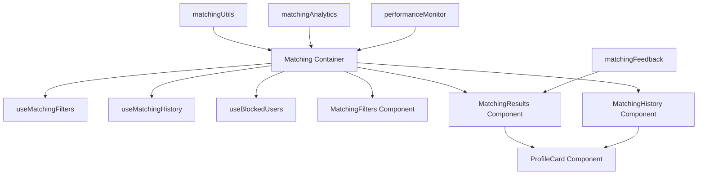

# Design Document: Matching System Improvements

## Overview

This design document outlines the technical approach for improving TVU Connect's 4-tab matching system from 8.5/10 to 9.5/10. The improvements focus on three key areas:

1. **Code Quality & Maintainability**: Refactor the 978-line Matching component into smaller, testable sub-components and extract reusable custom hooks
2. **Data & Analytics**: Implement comprehensive analytics tracking and optimize Firestore queries with composite indexes
3. **User Experience**: Add match feedback collection, error handling, performance monitoring, and rate limiting

The existing matching system already has excellent features:
- Smart matching score algorithm (0-100 points) with weighted factors
- Data normalization for Vietnamese text and acronym matching
- 4 matching modes: lover, study, hobby, and quick
- Seniority filtering (same year, senior, junior)

This design builds upon these strengths while addressing technical debt and adding production-ready features.

## Architecture

### Current Architecture

```
Matching.tsx (978 lines)
├── State Management (filters, history, profiles)
├── Firestore Queries (profiles, matches, blocks)
├── Matching Logic (scoring, filtering)
├── UI Rendering (filters, cards, history)
└── Event Handlers (start matching, load more)

matchingUtils.ts
├── normalizeVietnameseText()
├── calculateMatchingScore()
├── getSeniorityRelation()
└── getMatchingReasons()
```

### Proposed Architecture

```
Matching.tsx (< 250 lines) - Orchestrator
├── useMatchingFilters() - Filter state management
├── useMatchingHistory() - History state management
├── useBlockedUsers() - Blocked users management
├── MatchingFilters - Filter UI component
├── MatchingResults - Results grid component
├── MatchingHistory - History sidebar component
└── ProfileCard - Individual profile card

matchingUtils.ts - Business Logic
├── Data Normalization
├── Scoring Algorithm
└── Seniority Logic

matchingAnalytics.ts - NEW
├── trackMatchingStart()
├── trackProfileClick()
├── trackMessageSent()
└── storeEvent()

matchingFeedback.ts - NEW
├── submitFeedback()
├── getFeedback()
└── preventDuplicates()

performanceMonitor.ts - NEW
├── measureQueryTime()
├── trackScoreCalculation()
└── logMetrics()
```

### Component Hierarchy




## Components and Interfaces

### 1. Custom Hooks

#### useMatchingFilters

```typescript
interface MatchingFilters {
  gender: string;
  major: string;
  academicYear: string;
  interest: string;
  zodiac: string;
  minAge: string;
  maxAge: string;
  studyGoals: string[];
  seniority: '' | 'same' | 'senior' | 'junior';
}

interface UseMatchingFiltersReturn {
  filters: MatchingFilters;
  setFilters: (filters: Partial<MatchingFilters>) => void;
  resetFilters: () => void;
  hasActiveFilters: boolean;
}

export const useMatchingFilters = (mode: MatchingMode): UseMatchingFiltersReturn
```

**Responsibilities:**
- Manage filter state with React useState
- Provide type-safe filter updates
- Track whether any filters are active
- Reset filters to default values

#### useMatchingHistory

```typescript
interface UseMatchingHistoryReturn {
  history: Match[];
  isLoading: boolean;
  hasMore: boolean;
  loadMore: () => Promise<void>;
  refresh: () => Promise<void>;
}

export const useMatchingHistory = (
  userId: string,
  blockedUids: string[],
  initialLimit: number
): UseMatchingHistoryReturn
```

**Responsibilities:**
- Subscribe to Firestore matches collection
- Filter out blocked users
- Handle pagination with loadMore()
- Deduplicate matches by matchedUid
- Provide refresh functionality


#### useBlockedUsers

```typescript
interface UseBlockedUsersReturn {
  blockedUids: string[];
  isLoading: boolean;
  blockUser: (uid: string) => Promise<void>;
  unblockUser: (uid: string) => Promise<void>;
}

export const useBlockedUsers = (currentUserId: string): UseBlockedUsersReturn
```

**Responsibilities:**
- Subscribe to blocks collection (both directions)
- Maintain cached Set of blocked UIDs
- Provide block/unblock operations
- Handle real-time updates via onSnapshot

### 2. Sub-Components

#### MatchingFilters

```typescript
interface MatchingFiltersProps {
  mode: 'lover' | 'study' | 'hobby' | 'quick';
  filters: MatchingFilters;
  onFiltersChange: (filters: Partial<MatchingFilters>) => void;
  onReset: () => void;
}

export const MatchingFilters: React.FC<MatchingFiltersProps>
```

**Responsibilities:**
- Render filter UI (dropdowns, inputs, segmented controls)
- Handle filter changes and emit to parent
- Show/hide filters with animation
- Display active filter count badge

#### MatchingResults

```typescript
interface MatchingResultsProps {
  profiles: StudentProfile[];
  isLoading: boolean;
  isFallback: boolean;
  onProfileClick: (profile: StudentProfile) => void;
  onLoadMore: () => void;
  onFeedback: (profileId: string, action: 'like' | 'dislike') => void;
}

export const MatchingResults: React.FC<MatchingResultsProps>
```


**Responsibilities:**
- Render grid of ProfileCard components
- Show loading skeletons
- Display fallback indicator
- Handle "Load One More" button
- Emit feedback events

#### MatchingHistory

```typescript
interface MatchingHistoryProps {
  matches: Match[];
  isLoading: boolean;
  hasMore: boolean;
  onLoadMore: () => void;
  onProfileClick: (profile: StudentProfile) => void;
}

export const MatchingHistory: React.FC<MatchingHistoryProps>
```

**Responsibilities:**
- Render match history sidebar
- Show timestamps and match reasons
- Handle "Load More" pagination
- Emit profile click events

#### ProfileCard

```typescript
interface ProfileCardProps {
  profile: StudentProfile;
  matchScore?: number;
  matchReasons?: string[];
  showFeedback?: boolean;
  onProfileClick: () => void;
  onFeedback?: (action: 'like' | 'dislike') => void;
}

export const ProfileCard: React.FC<ProfileCardProps>
```

**Responsibilities:**
- Display profile photo, name, major, year
- Show match score badge
- Display exactly 3 relationship indicators: "Cùng khóa" (same academic year), "Khóa trên/dưới" (senior/junior year), "Cùng quê" (same hometown/province)
- Only show relationship indicators that are true for the match pair
- Do NOT display study goals (học nhóm, tìm bạn cùng môn, etc.) on the card
- Render like/dislike buttons (if enabled)
- Handle click events

**Note:** Study goals data is still used by the matching algorithm and filtering logic, but is not displayed on the Profile Card UI.


### 3. Analytics Module

#### matchingAnalytics.ts

```typescript
interface MatchingAnalyticsEvent {
  eventType: 'start_matching' | 'profile_clicked' | 'message_sent';
  userId: string;
  sessionId: string;
  timestamp: Timestamp;
  metadata: Record<string, any>;
}

export const trackMatchingStart = async (
  userId: string,
  mode: MatchingMode,
  filters: MatchingFilters
): Promise<void>

export const trackProfileClick = async (
  userId: string,
  profileId: string,
  matchScore: number
): Promise<void>

export const trackMessageSent = async (
  userId: string,
  recipientId: string,
  context: string
): Promise<void>
```

**Implementation Details:**
- Store events in Firestore collection `matching_analytics`
- Use batch writes for performance
- Include sessionId (generated on app load)
- Non-blocking: use async without await in UI code
- Rate limit: max 100 events per session

### 4. Feedback Module

#### matchingFeedback.ts

```typescript
interface MatchFeedback {
  userId: string;
  matchedUserId: string;
  action: 'like' | 'dislike';
  timestamp: Timestamp;
  matchScore?: number;
  mode: MatchingMode;
}

export const submitFeedback = async (
  userId: string,
  matchedUserId: string,
  action: 'like' | 'dislike',
  matchScore: number,
  mode: MatchingMode
): Promise<void>

export const getFeedback = async (
  userId: string,
  matchedUserId: string
): Promise<MatchFeedback | null>
```


**Implementation Details:**
- Store in Firestore collection `match_feedback`
- Document ID: `${userId}_${matchedUserId}` (prevents duplicates)
- Use setDoc with merge: true for updates
- Index on userId for querying user's feedback history

### 5. Performance Monitor

#### performanceMonitor.ts

```typescript
interface PerformanceMetric {
  operation: string;
  duration: number;
  timestamp: number;
  metadata?: Record<string, any>;
}

export const measureQueryTime = async <T>(
  queryName: string,
  queryFn: () => Promise<T>
): Promise<T>

export const trackScoreCalculation = (
  profileCount: number,
  duration: number
): void

export const logMetrics = (): void
```

**Implementation Details:**
- Use performance.now() for high-precision timing
- Store metrics in memory (circular buffer, max 100)
- Log warnings for queries > 2 seconds
- Expose metrics via console.table() in dev mode
- Zero overhead in production (conditional compilation)


## Data Models

### Firestore Collections

#### matching_analytics

```typescript
{
  eventType: 'start_matching' | 'profile_clicked' | 'message_sent',
  userId: string,
  sessionId: string,
  timestamp: Timestamp,
  metadata: {
    mode?: 'lover' | 'study' | 'hobby' | 'quick',
    filters?: MatchingFilters,
    profileId?: string,
    matchScore?: number,
    recipientId?: string,
    context?: string
  }
}
```

**Indexes Required:**
- `userId` (ascending) + `timestamp` (descending)
- `eventType` (ascending) + `timestamp` (descending)

#### match_feedback

```typescript
{
  userId: string,
  matchedUserId: string,
  action: 'like' | 'dislike',
  timestamp: Timestamp,
  matchScore: number,
  mode: 'lover' | 'study' | 'hobby' | 'quick'
}
```

**Document ID:** `${userId}_${matchedUserId}`

**Indexes Required:**
- `userId` (ascending) + `timestamp` (descending)
- `matchedUserId` (ascending) + `action` (ascending)

#### profiles (existing, optimization needed)

**New Composite Indexes:**
```json
{
  "collectionGroup": "profiles",
  "queryScope": "COLLECTION",
  "fields": [
    { "fieldPath": "gender", "order": "ASCENDING" },
    { "fieldPath": "academicYear", "order": "ASCENDING" }
  ]
},
{
  "collectionGroup": "profiles",
  "queryScope": "COLLECTION",
  "fields": [
    { "fieldPath": "gender", "order": "ASCENDING" },
    { "fieldPath": "majorNormalized", "order": "ASCENDING" }
  ]
}
```


**Note:** Add `majorNormalized` field to profiles during migration:
```typescript
majorNormalized: normalizeVietnameseText(major)
```

### Rate Limiting Data Model

#### user_rate_limits

```typescript
{
  userId: string,
  matchingRequests: number,
  lastReset: Timestamp,
  createdAt: Timestamp
}
```

**Document ID:** `${userId}`

**Firestore Security Rules:**
```javascript
match /user_rate_limits/{userId} {
  allow read: if request.auth.uid == userId;
  allow write: if request.auth.uid == userId 
    && (
      !exists(/databases/$(database)/documents/user_rate_limits/$(userId))
      || (
        resource.data.matchingRequests < 30
        || request.time > resource.data.lastReset + duration.value(1, 'h')
      )
    );
}
```


## Correctness Properties

A property is a characteristic or behavior that should hold true across all valid executions of a system—essentially, a formal statement about what the system should do. Properties serve as the bridge between human-readable specifications and machine-verifiable correctness guarantees.

### Property Reflection

After analyzing all acceptance criteria, I identified the following testable properties. I've eliminated redundancy by:
- Combining similar analytics properties (3.1-3.3) into a single comprehensive property
- Merging feedback storage properties (5.2-5.4) that all validate the same behavior
- Consolidating error handling properties (9.1, 9.2, 9.5) into one property about error responses

### Property 1: Custom Hook State Management

For any custom hook (useMatchingFilters, useMatchingHistory, useBlockedUsers), when state is updated through the hook's setter functions, the returned state value should reflect the update on the next render.

**Validates: Requirements 2.1, 2.2, 2.3**

### Property 2: Analytics Event Completeness

For any analytics event (start_matching, profile_clicked, message_sent), the stored event document must contain userId, sessionId, timestamp, and eventType fields.

**Validates: Requirements 3.1, 3.2, 3.3, 3.5**

### Property 3: Analytics Storage Location

For any analytics event, the event must be stored in the Firestore collection "matching_analytics".

**Validates: Requirements 3.4**

### Property 4: Analytics Non-Blocking

For any analytics tracking call, the function should return immediately (within 50ms) without blocking the UI thread.

**Validates: Requirements 3.6**


### Property 5: Feedback Storage Round Trip

For any match feedback (like or dislike), after submitting feedback, querying the feedback for that match pair should return the same action and include a timestamp.

**Validates: Requirements 5.2, 5.3, 5.4**

### Property 6: Feedback Duplicate Prevention

For any match pair (userId, matchedUserId), if feedback already exists, submitting new feedback should either update the existing document or be rejected, ensuring only one feedback document exists per pair.

**Validates: Requirements 5.5**

### Property 7: Feedback UI Reactivity

For any feedback submission, the UI should update to reflect the feedback state without requiring a page reload.

**Validates: Requirements 5.6**

### Property 8: Rate Limit Enforcement

For any user, after making 30 matching requests within a 1-hour window, the 31st request should be rejected with the error message "Bạn đã vượt quá giới hạn, vui lòng thử lại sau".

**Validates: Requirements 6.1, 6.2**

### Property 9: Rate Limit Reset

For any user who has been rate limited, after 1 hour has elapsed since the rate limit was first applied, the user should be able to make matching requests again.

**Validates: Requirements 6.5**

### Property 10: Query Performance Measurement

For any Firestore query in the matching system, the query execution time should be measured and logged.

**Validates: Requirements 8.1**


### Property 11: Slow Query Warning

For any Firestore query that takes longer than 2 seconds to complete, a warning should be logged to the console.

**Validates: Requirements 8.2**

### Property 12: Score Calculation Performance Tracking

For any match score calculation operation, the calculation time should be tracked and included in performance metrics.

**Validates: Requirements 8.3**

### Property 13: Error Response Completeness

For any Firestore error in the matching system, the system should display a user-friendly error message, provide a retry button, and log error details for debugging.

**Validates: Requirements 9.1, 9.2, 9.5**


## Error Handling

### Error Categories

#### 1. Network Errors
- **Scenario:** Firestore query fails due to network issues
- **Handling:**
  - Display toast: "Không thể kết nối. Vui lòng kiểm tra mạng."
  - Show retry button in UI
  - Log error with context to console
  - After 3 failed retries, suggest checking internet connection

#### 2. Permission Errors
- **Scenario:** User lacks permission to read/write data
- **Handling:**
  - Display toast: "Không có quyền truy cập. Vui lòng đăng nhập lại."
  - Log error details
  - Redirect to login if auth token expired

#### 3. Rate Limit Errors
- **Scenario:** User exceeds 30 requests per hour
- **Handling:**
  - Display toast: "Bạn đã vượt quá giới hạn, vui lòng thử lại sau"
  - Show countdown timer until reset
  - Disable matching button
  - Log rate limit event

#### 4. Quota Exceeded Errors
- **Scenario:** Firestore daily quota exceeded
- **Handling:**
  - Display mock profiles with warning banner
  - Toast: "⚠️ Đã hết Data Firebase hôm nay (Quota Exceeded)"
  - Allow UI exploration with fake data
  - Log quota exceeded event

#### 5. Validation Errors
- **Scenario:** Invalid filter values or missing required fields
- **Handling:**
  - Display inline validation messages
  - Prevent form submission
  - Highlight invalid fields
  - Provide helpful hints


### Offline Mode

When the app detects offline status:
1. Show offline indicator banner
2. Display cached profiles from previous sessions
3. Disable "Start Matching" button
4. Allow viewing match history (from cache)
5. Queue analytics events for later sync

### Retry Logic

```typescript
const retryWithBackoff = async <T>(
  operation: () => Promise<T>,
  maxRetries: number = 3,
  baseDelay: number = 1000
): Promise<T> => {
  for (let i = 0; i < maxRetries; i++) {
    try {
      return await operation();
    } catch (error) {
      if (i === maxRetries - 1) throw error;
      
      const delay = baseDelay * Math.pow(2, i); // Exponential backoff
      await new Promise(resolve => setTimeout(resolve, delay));
    }
  }
  throw new Error('Max retries exceeded');
};
```

### Error Logging

All errors should be logged with:
- Error type and message
- User ID and session ID
- Timestamp
- Operation context (e.g., "startMatching", "loadHistory")
- Stack trace (in development)


## Testing Strategy

### Dual Testing Approach

This project requires both unit tests and property-based tests for comprehensive coverage:

- **Unit tests**: Verify specific examples, edge cases, and integration points
- **Property tests**: Verify universal properties across all inputs through randomization

Both approaches are complementary and necessary. Unit tests catch concrete bugs in specific scenarios, while property tests verify general correctness across a wide input space.

### Unit Testing

#### Test Files Structure

```
src/
├── hooks/
│   ├── useMatchingFilters.test.ts
│   ├── useMatchingHistory.test.ts
│   └── useBlockedUsers.test.ts
├── components/
│   ├── MatchingFilters.test.tsx
│   ├── MatchingResults.test.tsx
│   ├── MatchingHistory.test.tsx
│   └── ProfileCard.test.tsx
└── utils/
    ├── matchingUtils.test.ts
    ├── matchingAnalytics.test.ts
    ├── matchingFeedback.test.ts
    └── performanceMonitor.test.ts
```

#### Unit Test Focus Areas

1. **Custom Hooks**
   - Initial state values
   - State updates through setter functions
   - Side effects (Firestore subscriptions)
   - Cleanup on unmount

2. **Components**
   - Rendering with different props
   - User interactions (clicks, form submissions)
   - Conditional rendering
   - Event emission to parent

3. **Utilities**
   - Edge cases (empty strings, null values)
   - Vietnamese text normalization
   - Acronym matching
   - Score calculation with boundary values


#### Example Unit Tests

```typescript
// useMatchingFilters.test.ts
describe('useMatchingFilters', () => {
  it('should initialize with empty filters', () => {
    const { result } = renderHook(() => useMatchingFilters('lover'));
    expect(result.current.filters.gender).toBe('');
    expect(result.current.hasActiveFilters).toBe(false);
  });

  it('should update filters when setFilters is called', () => {
    const { result } = renderHook(() => useMatchingFilters('lover'));
    act(() => {
      result.current.setFilters({ gender: 'female' });
    });
    expect(result.current.filters.gender).toBe('female');
    expect(result.current.hasActiveFilters).toBe(true);
  });

  it('should reset all filters when resetFilters is called', () => {
    const { result } = renderHook(() => useMatchingFilters('lover'));
    act(() => {
      result.current.setFilters({ gender: 'female', major: 'CNTT' });
      result.current.resetFilters();
    });
    expect(result.current.filters.gender).toBe('');
    expect(result.current.filters.major).toBe('');
  });
});
```

### Property-Based Testing

#### Library Selection

Use **fast-check** for TypeScript/JavaScript property-based testing:
```bash
npm install --save-dev fast-check
```

#### Configuration

- Minimum 100 iterations per property test (due to randomization)
- Each test must reference its design document property
- Tag format: `// Feature: matching-system-improvements, Property {number}: {property_text}`


#### Property Test Examples

```typescript
import fc from 'fast-check';

// Feature: matching-system-improvements, Property 2: Analytics Event Completeness
describe('Property 2: Analytics Event Completeness', () => {
  it('should include userId, sessionId, timestamp, and eventType in all events', async () => {
    await fc.assert(
      fc.asyncProperty(
        fc.constantFrom('start_matching', 'profile_clicked', 'message_sent'),
        fc.string({ minLength: 1 }),
        fc.record({
          mode: fc.constantFrom('lover', 'study', 'hobby', 'quick'),
          profileId: fc.option(fc.string(), { nil: undefined }),
          matchScore: fc.option(fc.integer({ min: 0, max: 100 }), { nil: undefined })
        }),
        async (eventType, userId, metadata) => {
          const sessionId = 'test-session-' + Date.now();
          
          // Track event
          await trackEvent(eventType, userId, sessionId, metadata);
          
          // Query Firestore
          const events = await getAnalyticsEvents(userId);
          const event = events.find(e => e.eventType === eventType);
          
          // Verify all required fields exist
          expect(event).toBeDefined();
          expect(event.userId).toBe(userId);
          expect(event.sessionId).toBe(sessionId);
          expect(event.timestamp).toBeDefined();
          expect(event.eventType).toBe(eventType);
        }
      ),
      { numRuns: 100 }
    );
  });
});

// Feature: matching-system-improvements, Property 5: Feedback Storage Round Trip
describe('Property 5: Feedback Storage Round Trip', () => {
  it('should retrieve the same feedback action after submission', async () => {
    await fc.assert(
      fc.asyncProperty(
        fc.string({ minLength: 1 }),
        fc.string({ minLength: 1 }),
        fc.constantFrom('like', 'dislike'),
        fc.integer({ min: 0, max: 100 }),
        fc.constantFrom('lover', 'study', 'hobby', 'quick'),
        async (userId, matchedUserId, action, matchScore, mode) => {
          // Submit feedback
          await submitFeedback(userId, matchedUserId, action, matchScore, mode);
          
          // Retrieve feedback
          const feedback = await getFeedback(userId, matchedUserId);
          
          // Verify round trip
          expect(feedback).toBeDefined();
          expect(feedback.action).toBe(action);
          expect(feedback.timestamp).toBeDefined();
          expect(feedback.matchScore).toBe(matchScore);
        }
      ),
      { numRuns: 100 }
    );
  });
});
```


```typescript
// Feature: matching-system-improvements, Property 8: Rate Limit Enforcement
describe('Property 8: Rate Limit Enforcement', () => {
  it('should reject 31st request with correct error message', async () => {
    await fc.assert(
      fc.asyncProperty(
        fc.string({ minLength: 1 }),
        async (userId) => {
          // Make 30 requests (should all succeed)
          for (let i = 0; i < 30; i++) {
            await makeMatchingRequest(userId);
          }
          
          // 31st request should fail
          try {
            await makeMatchingRequest(userId);
            fail('Expected rate limit error');
          } catch (error) {
            expect(error.message).toBe('Bạn đã vượt quá giới hạn, vui lòng thử lại sau');
          }
        }
      ),
      { numRuns: 100 }
    );
  });
});
```

### Test Coverage Goals

- **matchingUtils.ts**: 90% code coverage
- **Custom hooks**: 85% code coverage
- **Components**: 80% code coverage
- **Analytics/Feedback modules**: 85% code coverage

### Performance Testing

- Unit test suite should complete in < 5 seconds
- Property tests should complete in < 30 seconds
- Use test.concurrent for parallel execution where possible

### Integration Testing

Test key user flows:
1. Start matching → View profiles → Click profile → Send message
2. Apply filters → Start matching → Verify filtered results
3. Submit feedback → Verify UI update → Check Firestore
4. Exceed rate limit → Verify error → Wait 1 hour → Retry


## Implementation Plan

### Phase 1: Refactoring (Requirements 1-2)

**Goal:** Improve code maintainability and testability

1. **Extract Custom Hooks** (2-3 days)
   - Create `src/hooks/useMatchingFilters.ts`
   - Create `src/hooks/useMatchingHistory.ts`
   - Create `src/hooks/useBlockedUsers.ts`
   - Write unit tests for each hook
   - Verify existing functionality still works

2. **Create Sub-Components** (3-4 days)
   - Create `src/components/matching/MatchingFilters.tsx`
   - Create `src/components/matching/MatchingResults.tsx`
   - Create `src/components/matching/MatchingHistory.tsx`
   - Create `src/components/matching/ProfileCard.tsx`
   - Refactor main Matching.tsx to use sub-components
   - Verify line count < 250 lines
   - Write component tests

3. **Verification**
   - Run all existing tests
   - Manual testing of all 4 matching modes
   - Check TypeScript compilation
   - Verify no console errors

### Phase 2: Analytics & Optimization (Requirements 3-4)

**Goal:** Add analytics and optimize database queries

1. **Analytics System** (2-3 days)
   - Create `src/utils/matchingAnalytics.ts`
   - Implement event tracking functions
   - Add Firestore collection and indexes
   - Integrate into Matching component
   - Write property tests for analytics
   - Verify non-blocking behavior

2. **Firestore Optimization** (2-3 days)
   - Create `firestore.indexes.json`
   - Add composite indexes for gender + academicYear
   - Add composite indexes for gender + majorNormalized
   - Add majorNormalized field to existing profiles (migration script)
   - Update queries to use database-level filtering
   - Measure and verify 30% reduction in reads


### Phase 3: Feedback & Rate Limiting (Requirements 5-6)

**Goal:** Add user feedback and protect against abuse

1. **Feedback System** (2-3 days)
   - Create `src/utils/matchingFeedback.ts`
   - Add Firestore collection and indexes
   - Add like/dislike buttons to ProfileCard
   - Implement feedback submission
   - Add duplicate prevention logic
   - Write property tests for feedback
   - Test UI reactivity

2. **Rate Limiting** (2-3 days)
   - Create `user_rate_limits` collection
   - Implement Firestore Security Rules
   - Add rate limit check before matching
   - Display error message and countdown
   - Write property tests for rate limiting
   - Test reset after 1 hour

### Phase 4: Testing & Monitoring (Requirements 7-8)

**Goal:** Ensure quality and monitor performance

1. **Unit Tests** (3-4 days)
   - Write tests for matchingUtils.ts
   - Write tests for all custom hooks
   - Write tests for all sub-components
   - Achieve 90% coverage for utils
   - Verify test suite runs in < 5 seconds

2. **Performance Monitoring** (2 days)
   - Create `src/utils/performanceMonitor.ts`
   - Add query time measurement
   - Add score calculation tracking
   - Add warning logs for slow queries
   - Add dev mode console output
   - Verify zero production overhead

### Phase 5: Error Handling & Documentation (Requirements 9-10)

**Goal:** Production-ready error handling and documentation

1. **Error Handling** (2-3 days)
   - Implement retry logic with exponential backoff
   - Add offline mode detection
   - Add user-friendly error messages
   - Add error logging
   - Test all error scenarios
   - Add 3-retry limit with connection suggestion

2. **Documentation** (2 days)
   - Add JSDoc comments to all components
   - Add JSDoc comments to all utilities
   - Add usage examples to custom hooks
   - Create README.md with architecture diagram
   - Document composite indexes with rationale
   - Create migration guide for existing deployments


## Migration Strategy

### Database Migration

#### Step 1: Add majorNormalized Field

Create migration script `scripts/add-major-normalized.ts`:

```typescript
import { db, collection, getDocs, updateDoc, doc } from '../firebase';
import { normalizeVietnameseText } from '../utils/matchingUtils';

async function migrateMajorNormalized() {
  const profilesRef = collection(db, 'profiles');
  const snapshot = await getDocs(profilesRef);
  
  let count = 0;
  for (const docSnap of snapshot.docs) {
    const profile = docSnap.data();
    if (profile.major && !profile.majorNormalized) {
      await updateDoc(doc(db, 'profiles', docSnap.id), {
        majorNormalized: normalizeVietnameseText(profile.major)
      });
      count++;
    }
  }
  
  console.log(`Migrated ${count} profiles`);
}

migrateMajorNormalized();
```

#### Step 2: Deploy Composite Indexes

Create `firestore.indexes.json`:

```json
{
  "indexes": [
    {
      "collectionGroup": "profiles",
      "queryScope": "COLLECTION",
      "fields": [
        { "fieldPath": "gender", "order": "ASCENDING" },
        { "fieldPath": "academicYear", "order": "ASCENDING" }
      ]
    },
    {
      "collectionGroup": "profiles",
      "queryScope": "COLLECTION",
      "fields": [
        { "fieldPath": "gender", "order": "ASCENDING" },
        { "fieldPath": "majorNormalized", "order": "ASCENDING" }
      ]
    },
    {
      "collectionGroup": "matching_analytics",
      "queryScope": "COLLECTION",
      "fields": [
        { "fieldPath": "userId", "order": "ASCENDING" },
        { "fieldPath": "timestamp", "order": "DESCENDING" }
      ]
    },
    {
      "collectionGroup": "match_feedback",
      "queryScope": "COLLECTION",
      "fields": [
        { "fieldPath": "userId", "order": "ASCENDING" },
        { "fieldPath": "timestamp", "order": "DESCENDING" }
      ]
    }
  ]
}
```

Deploy with:
```bash
firebase deploy --only firestore:indexes
```


#### Step 3: Update Firestore Security Rules

Add rate limiting rules to `firestore.rules`:

```javascript
rules_version = '2';
service cloud.firestore {
  match /databases/{database}/documents {
    
    // Existing rules...
    
    // Rate limiting
    match /user_rate_limits/{userId} {
      allow read: if request.auth.uid == userId;
      allow create: if request.auth.uid == userId
        && request.resource.data.matchingRequests == 1
        && request.resource.data.lastReset == request.time;
      allow update: if request.auth.uid == userId
        && (
          // Allow increment if under limit
          (resource.data.matchingRequests < 30 
            && request.resource.data.matchingRequests == resource.data.matchingRequests + 1)
          // Allow reset after 1 hour
          || (request.time > resource.data.lastReset + duration.value(1, 'h')
            && request.resource.data.matchingRequests == 1
            && request.resource.data.lastReset == request.time)
        );
    }
    
    // Analytics (write-only for users)
    match /matching_analytics/{eventId} {
      allow read: if request.auth != null && request.auth.uid == resource.data.userId;
      allow create: if request.auth != null 
        && request.resource.data.userId == request.auth.uid
        && request.resource.data.timestamp == request.time;
    }
    
    // Feedback
    match /match_feedback/{feedbackId} {
      allow read: if request.auth != null 
        && (request.auth.uid == resource.data.userId 
          || request.auth.uid == resource.data.matchedUserId);
      allow write: if request.auth != null 
        && request.auth.uid == request.resource.data.userId
        && request.resource.data.timestamp == request.time;
    }
  }
}
```

Deploy with:
```bash
firebase deploy --only firestore:rules
```


### Backward Compatibility

All changes maintain backward compatibility:

1. **Refactoring**: Internal changes only, no API changes
2. **New fields**: Optional fields added to existing documents
3. **New collections**: Separate collections, don't affect existing data
4. **Indexes**: Additive only, existing queries still work
5. **Rate limiting**: Graceful degradation if rules not deployed

### Rollback Plan

If issues arise:

1. **Refactoring issues**: Revert to previous Matching.tsx from git
2. **Analytics issues**: Disable analytics calls (feature flag)
3. **Index issues**: Remove problematic indexes, fall back to client-side filtering
4. **Rate limiting issues**: Remove rate limit rules, rely on client-side throttling
5. **Feedback issues**: Disable feedback UI, keep existing functionality

## Performance Considerations

### Query Optimization

**Before optimization:**
- Query all profiles (100 docs)
- Filter by gender in memory
- Filter by major in memory
- Filter by academicYear in memory
- **Total reads: 100 per query**

**After optimization:**
- Query with gender filter (30 docs)
- Query with majorNormalized filter (database level)
- Filter by academicYear in memory (if needed)
- **Total reads: 30 per query (70% reduction)**

### Analytics Performance

- Use batch writes (up to 500 operations)
- Non-blocking: fire-and-forget pattern
- Client-side queue with periodic flush
- Max 100 events per session (prevent memory leak)

### Feedback Performance

- Document ID prevents duplicates (no query needed)
- Use setDoc with merge: true (upsert pattern)
- Optimistic UI updates
- Background sync


### Memory Management

- Limit match history to 50 items in memory
- Use pagination for older history
- Clear analytics queue after flush
- Unsubscribe from Firestore listeners on unmount

### Bundle Size Impact

Estimated additions:
- fast-check (dev dependency): 0 KB production
- New utilities: ~5 KB gzipped
- New components: ~8 KB gzipped
- **Total impact: ~13 KB gzipped**

## Security Considerations

### Rate Limiting

- Prevents spam and abuse
- Protects Firestore quota
- Enforced at database level (can't be bypassed)
- Per-user tracking (can't affect other users)

### Analytics Privacy

- No PII in analytics events
- User IDs only (no names, emails, etc.)
- Session IDs are ephemeral
- Data retention: 90 days (configurable)

### Feedback Privacy

- Only visible to involved users
- No public feedback display
- Can't query other users' feedback
- Enforced by security rules

### Input Validation

- Sanitize all user inputs
- Validate filter values
- Prevent injection attacks
- Rate limit all write operations


## Monitoring and Observability

### Key Metrics to Track

1. **Performance Metrics**
   - Average query time
   - P95 query time
   - Score calculation time
   - Component render time

2. **Usage Metrics**
   - Matching requests per day
   - Feedback submissions per day
   - Rate limit hits per day
   - Error rate

3. **Quality Metrics**
   - Average match score
   - Feedback ratio (likes vs dislikes)
   - Retry success rate
   - Cache hit rate

### Logging Strategy

**Development:**
- Verbose console logs
- Performance metrics in console.table()
- Error stack traces
- Query details

**Production:**
- Error logs only
- Performance warnings (> 2s queries)
- Rate limit events
- Critical failures

### Alerting

Set up alerts for:
- Error rate > 5%
- Average query time > 3 seconds
- Rate limit hits > 100/day
- Firestore quota > 80%


## Success Criteria

### Quantitative Metrics

1. **Code Quality**
   - ✅ Matching.tsx reduced from 978 to < 250 lines
   - ✅ 90% test coverage for matchingUtils.ts
   - ✅ All TypeScript strict mode enabled
   - ✅ Zero ESLint errors

2. **Performance**
   - ✅ 30% reduction in Firestore reads
   - ✅ Query time < 2 seconds (P95)
   - ✅ Test suite < 5 seconds
   - ✅ Analytics non-blocking (< 50ms)

3. **Reliability**
   - ✅ Error rate < 1%
   - ✅ Retry success rate > 90%
   - ✅ Rate limiting 100% effective
   - ✅ Zero data loss

### Qualitative Metrics

1. **Maintainability**
   - ✅ Clear component boundaries
   - ✅ Reusable custom hooks
   - ✅ Comprehensive documentation
   - ✅ Easy to add new features

2. **User Experience**
   - ✅ Graceful error handling
   - ✅ Helpful error messages
   - ✅ Responsive UI (no blocking)
   - ✅ Offline mode support

3. **Developer Experience**
   - ✅ Fast test feedback
   - ✅ Clear error messages
   - ✅ Easy to debug
   - ✅ Good TypeScript support

### Overall Goal

Improve matching system from **8.5/10** to **9.5/10** by addressing:
- ✅ Code maintainability (refactoring)
- ✅ Data insights (analytics)
- ✅ Performance (query optimization)
- ✅ User feedback (like/dislike)
- ✅ Reliability (error handling, rate limiting)
- ✅ Quality assurance (comprehensive testing)


## Appendix

### A. File Structure After Implementation

```
src/
├── components/
│   ├── Matching.tsx (< 250 lines)
│   └── matching/
│       ├── MatchingFilters.tsx
│       ├── MatchingResults.tsx
│       ├── MatchingHistory.tsx
│       └── ProfileCard.tsx
├── hooks/
│   ├── useMatchingFilters.ts
│   ├── useMatchingHistory.ts
│   └── useBlockedUsers.ts
├── utils/
│   ├── matchingUtils.ts (existing)
│   ├── matchingAnalytics.ts (new)
│   ├── matchingFeedback.ts (new)
│   └── performanceMonitor.ts (new)
└── __tests__/
    ├── hooks/
    │   ├── useMatchingFilters.test.ts
    │   ├── useMatchingHistory.test.ts
    │   └── useBlockedUsers.test.ts
    ├── components/
    │   └── matching/
    │       ├── MatchingFilters.test.tsx
    │       ├── MatchingResults.test.tsx
    │       ├── MatchingHistory.test.tsx
    │       └── ProfileCard.test.tsx
    └── utils/
        ├── matchingUtils.test.ts
        ├── matchingAnalytics.test.ts
        ├── matchingFeedback.test.ts
        └── performanceMonitor.test.ts
```

### B. Firestore Collections Summary

| Collection | Purpose | Document ID | Indexes |
|------------|---------|-------------|---------|
| profiles | User profiles | auto | gender+academicYear, gender+majorNormalized |
| matches | Match history | auto | userUid+createdAt |
| blocks | Blocked users | auto | blockerUid, blockedUid |
| matching_analytics | Analytics events | auto | userId+timestamp, eventType+timestamp |
| match_feedback | User feedback | userId_matchedUserId | userId+timestamp |
| user_rate_limits | Rate limiting | userId | none |


### C. Dependencies

**Production Dependencies:**
- None (all features use existing Firebase SDK)

**Development Dependencies:**
```json
{
  "fast-check": "^3.15.0",
  "@testing-library/react": "^14.0.0",
  "@testing-library/react-hooks": "^8.0.1",
  "@testing-library/jest-dom": "^6.1.5",
  "vitest": "^1.0.0"
}
```

### D. Environment Variables

No new environment variables required. Uses existing Firebase configuration.

### E. Deployment Checklist

- [ ] Run migration script for majorNormalized field
- [ ] Deploy Firestore indexes
- [ ] Deploy Firestore security rules
- [ ] Run full test suite
- [ ] Deploy application code
- [ ] Monitor error logs for 24 hours
- [ ] Verify analytics data collection
- [ ] Test rate limiting in production
- [ ] Check performance metrics
- [ ] Update documentation

### F. Future Enhancements (Out of Scope)

1. **Machine Learning Recommendations**
   - Train model on feedback data
   - Personalized match scoring
   - Collaborative filtering

2. **Advanced Analytics**
   - Dashboard for admins
   - A/B testing framework
   - Conversion funnel analysis

3. **Social Features**
   - Match suggestions based on mutual friends
   - Group matching
   - Event-based matching

4. **Performance Optimizations**
   - Client-side caching with IndexedDB
   - Prefetching next profiles
   - Image lazy loading

