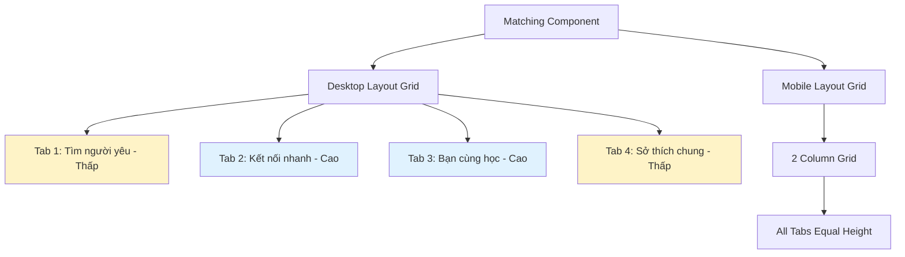
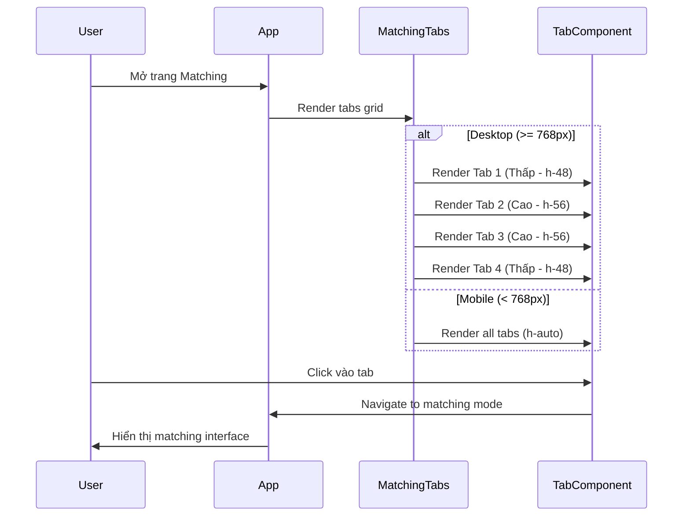

# Design Document: Matching Tabs Zigzag Layout

## Overview

Thiết kế bố cục zigzag hiện đại cho 4 tab matching trong TVU Connect, tạo trải nghiệm thị giác độc đáo với 2 tab cao xen kẽ 2 tab thấp. Bố cục này giữ nguyên toàn bộ chức năng hiện tại, chỉ thay đổi giao diện để tạo sự khác biệt và thu hút người dùng.

## Architecture



## Main Algorithm/Workflow



## Core Interfaces/Types

```typescript
interface MatchingTabConfig {
  id: 'lover' | 'quick' | 'study' | 'hobby';
  title: string;
  description: string;
  icon: React.ComponentType;
  heightClass: 'h-48' | 'h-56'; // Desktop height
  paddingClass: string; // Padding for content
  isLocked: boolean;
}

interface ZigzagLayoutProps {
  tabs: MatchingTabConfig[];
  currentUser: User;
  onTabClick: (mode: string) => void;
  isProfileComplete: boolean;
}

interface TabCardProps {
  config: MatchingTabConfig;
  isLocked: boolean;
  onClick: () => void;
  heightClass: string;
  paddingClass: string;
}
```

## Components and Interfaces

### Component 1: ZigzagMatchingTabs

**Purpose**: Container component quản lý bố cục zigzag cho 4 tab matching

**Interface**:
```typescript
interface ZigzagMatchingTabsProps {
  currentUser: User;
  onModeSelect: (mode: 'lover' | 'quick' | 'study' | 'hobby') => void;
  isProfileComplete: boolean;
}
```

**Responsibilities**:
- Render grid layout với 4 tab theo pattern zigzag
- Xử lý responsive: desktop (zigzag) vs mobile (equal height)
- Quản lý trạng thái locked/unlocked của từng tab
- Điều hướng khi user click vào tab

### Component 2: MatchingTabCard

**Purpose**: Component đại diện cho mỗi tab matching với chiều cao và padding tùy chỉnh

**Interface**:
```typescript
interface MatchingTabCardProps {
  mode: 'lover' | 'quick' | 'study' | 'hobby';
  title: string;
  description: string;
  icon: React.ComponentType;
  heightClass: string;
  paddingClass: string;
  isLocked: boolean;
  onClick: () => void;
}
```

**Responsibilities**:
- Hiển thị icon, title, description của tab
- Apply chiều cao và padding theo config
- Hiển thị trạng thái locked với icon 🔒
- Xử lý hover effects và click events
- Hỗ trợ dark mode

## Data Models

### Model 1: TabConfiguration

```typescript
interface TabConfiguration {
  // Tab identity
  id: 'lover' | 'quick' | 'study' | 'hobby';
  
  // Display content
  title: string;
  description: string;
  icon: React.ComponentType;
  
  // Layout properties
  desktop: {
    heightClass: 'h-48' | 'h-56';
    paddingTop: string;
    paddingBottom: string;
  };
  
  mobile: {
    heightClass: 'h-auto';
    padding: string;
  };
  
  // State
  requiresCompleteProfile: boolean;
}
```

**Validation Rules**:
- `id` phải là một trong 4 giá trị: 'lover', 'quick', 'study', 'hobby'
- `heightClass` trên desktop chỉ có 2 giá trị: 'h-48' (thấp) hoặc 'h-56' (cao)
- Pattern zigzag: Tab 1 và 4 thấp (h-48), Tab 2 và 3 cao (h-56)
- Mobile luôn dùng 'h-auto' để responsive

### Model 2: LayoutConfig

```typescript
interface LayoutConfig {
  desktop: {
    gridCols: 'grid-cols-4';
    gap: 'gap-4';
    tabHeights: ['h-48', 'h-56', 'h-56', 'h-48'];
  };
  
  mobile: {
    gridCols: 'grid-cols-2';
    gap: 'gap-3';
    tabHeights: ['h-auto', 'h-auto', 'h-auto', 'h-auto'];
  };
}
```

**Validation Rules**:
- Desktop grid phải có 4 cột
- Mobile grid phải có 2 cột
- Gap không được quá lớn để tránh tabs quá xa nhau
- Tab heights phải tuân theo pattern zigzag trên desktop

## Algorithmic Pseudocode

### Main Rendering Algorithm

```pascal
ALGORITHM renderZigzagMatchingTabs(currentUser, isProfileComplete)
INPUT: currentUser of type User, isProfileComplete of type boolean
OUTPUT: rendered JSX element

BEGIN
  // Step 1: Define tab configurations with zigzag pattern
  tabs ← [
    {id: 'lover', title: 'Tìm người yêu', heightClass: 'h-48', paddingClass: 'pt-6 pb-6'},
    {id: 'quick', title: 'Kết nối nhanh', heightClass: 'h-56', paddingClass: 'pt-8 pb-8'},
    {id: 'study', title: 'Bạn cùng học', heightClass: 'h-56', paddingClass: 'pt-8 pb-8'},
    {id: 'hobby', title: 'Sở thích chung', heightClass: 'h-48', paddingClass: 'pt-6 pb-6'}
  ]
  
  // Step 2: Determine locked state for each tab
  FOR each tab IN tabs DO
    IF NOT isProfileComplete THEN
      tab.isLocked ← true
    ELSE
      tab.isLocked ← false
    END IF
  END FOR
  
  // Step 3: Render grid with responsive classes
  RETURN (
    <div className="grid grid-cols-2 md:grid-cols-4 gap-3 md:gap-4">
      FOR each tab IN tabs DO
        <MatchingTabCard
          config={tab}
          isLocked={tab.isLocked}
          onClick={() => handleTabClick(tab.id)}
          heightClass={tab.heightClass}
          paddingClass={tab.paddingClass}
        />
      END FOR
    </div>
  )
END
```

**Preconditions:**
- `currentUser` không null và có uid hợp lệ
- `isProfileComplete` là boolean value
- Tất cả tab configs được định nghĩa đầy đủ

**Postconditions:**
- Render 4 tabs theo pattern zigzag trên desktop
- Render 4 tabs với chiều cao đều nhau trên mobile
- Tabs bị locked nếu profile chưa hoàn thiện
- Grid layout responsive với breakpoint tại 768px

**Loop Invariants:**
- Mỗi tab trong vòng lặp có đầy đủ properties (id, title, heightClass, paddingClass)
- Locked state được xác định đúng cho từng tab
- Thứ tự tabs được giữ nguyên: lover → quick → study → hobby

### Tab Click Handler Algorithm

```pascal
ALGORITHM handleTabClick(tabId, isLocked, navigate)
INPUT: tabId of type string, isLocked of type boolean, navigate of type function
OUTPUT: navigation action or toast message

BEGIN
  // Step 1: Check if tab is locked
  IF isLocked THEN
    DISPLAY toast.error("Vui lòng hoàn thiện profile để mở khóa tính năng này")
    RETURN
  END IF
  
  // Step 2: Navigate to matching mode
  navigate(`/matching/${tabId}`)
  
  // Step 3: Track analytics (optional)
  trackEvent('tab_click', {
    tab_id: tabId,
    timestamp: Date.now()
  })
END
```

**Preconditions:**
- `tabId` là một trong 4 giá trị hợp lệ: 'lover', 'quick', 'study', 'hobby'
- `isLocked` là boolean value
- `navigate` là function hợp lệ từ router

**Postconditions:**
- Nếu locked: hiển thị toast error, không navigate
- Nếu unlocked: navigate đến matching mode tương ứng
- Analytics event được track (nếu có)

### Responsive Height Calculation Algorithm

```pascal
ALGORITHM calculateTabHeight(tabIndex, viewport)
INPUT: tabIndex of type number (0-3), viewport of type string ('mobile' | 'desktop')
OUTPUT: heightClass of type string

BEGIN
  // Step 1: Check viewport
  IF viewport == 'mobile' THEN
    RETURN 'h-auto'
  END IF
  
  // Step 2: Apply zigzag pattern for desktop
  IF tabIndex == 0 OR tabIndex == 3 THEN
    // Tab 1 (Tìm người yêu) và Tab 4 (Sở thích chung) - Thấp
    RETURN 'h-48'
  ELSE IF tabIndex == 1 OR tabIndex == 2 THEN
    // Tab 2 (Kết nối nhanh) và Tab 3 (Bạn cùng học) - Cao
    RETURN 'h-56'
  END IF
END
```

**Preconditions:**
- `tabIndex` trong khoảng 0-3
- `viewport` là 'mobile' hoặc 'desktop'

**Postconditions:**
- Mobile: luôn trả về 'h-auto'
- Desktop: trả về 'h-48' cho tab 1 và 4, 'h-56' cho tab 2 và 3
- Pattern zigzag được đảm bảo: thấp-cao-cao-thấp

**Loop Invariants:** N/A (không có vòng lặp)

## Key Functions with Formal Specifications

### Function 1: renderMatchingTabCard()

```typescript
function renderMatchingTabCard(
  config: TabConfiguration,
  isLocked: boolean,
  onClick: () => void
): JSX.Element
```

**Preconditions:**
- `config` không null và có đầy đủ properties (id, title, description, icon, heightClass, paddingClass)
- `config.heightClass` là 'h-48' hoặc 'h-56' trên desktop, 'h-auto' trên mobile
- `isLocked` là boolean value
- `onClick` là function hợp lệ

**Postconditions:**
- Trả về JSX element với chiều cao đúng theo config
- Hiển thị icon 🔒 nếu isLocked === true
- Apply hover effects nếu isLocked === false
- Responsive: full height trên desktop, auto height trên mobile
- Dark mode được hỗ trợ

**Loop Invariants:** N/A

### Function 2: getZigzagPattern()

```typescript
function getZigzagPattern(): Array<'h-48' | 'h-56'>
```

**Preconditions:**
- Không có input parameters

**Postconditions:**
- Trả về array với 4 phần tử: ['h-48', 'h-56', 'h-56', 'h-48']
- Pattern đảm bảo zigzag: thấp-cao-cao-thấp
- Immutable array (không thay đổi sau khi tạo)

**Loop Invariants:** N/A

### Function 3: isTabLocked()

```typescript
function isTabLocked(
  tabId: string,
  isProfileComplete: boolean
): boolean
```

**Preconditions:**
- `tabId` là một trong 4 giá trị: 'lover', 'quick', 'study', 'hobby'
- `isProfileComplete` là boolean value

**Postconditions:**
- Trả về true nếu profile chưa hoàn thiện
- Trả về false nếu profile đã hoàn thiện
- Logic đơn giản: tất cả tabs đều bị lock nếu profile chưa hoàn thiện

**Loop Invariants:** N/A

## Example Usage

```typescript
// Example 1: Render zigzag matching tabs
import { ZigzagMatchingTabs } from './components/ZigzagMatchingTabs';

function MatchingPage() {
  const currentUser = useAuth();
  const navigate = useNavigate();
  const isProfileComplete = useProfileCompletion(currentUser.uid);
  
  const handleModeSelect = (mode: string) => {
    navigate(`/matching/${mode}`);
  };
  
  return (
    <div className="container mx-auto px-4 py-8">
      <h1 className="text-3xl font-bold mb-6">Ghép đôi</h1>
      
      <ZigzagMatchingTabs
        currentUser={currentUser}
        onModeSelect={handleModeSelect}
        isProfileComplete={isProfileComplete}
      />
    </div>
  );
}

// Example 2: Individual tab card with custom height
import { MatchingTabCard } from './components/MatchingTabCard';
import { Heart } from 'lucide-react';

function CustomTab() {
  return (
    <MatchingTabCard
      mode="lover"
      title="Tìm người yêu"
      description="Tìm kiếm nửa kia tại TVU"
      icon={Heart}
      heightClass="h-48"
      paddingClass="pt-6 pb-6"
      isLocked={false}
      onClick={() => console.log('Tab clicked')}
    />
  );
}

// Example 3: Get zigzag pattern programmatically
const pattern = getZigzagPattern();
console.log(pattern); // ['h-48', 'h-56', 'h-56', 'h-48']

tabs.forEach((tab, index) => {
  tab.heightClass = pattern[index];
});

// Example 4: Check if tab should be locked
const isLocked = isTabLocked('lover', isProfileComplete);
if (isLocked) {
  toast.error('Vui lòng hoàn thiện profile');
} else {
  navigate('/matching/lover');
}

// Example 5: Responsive height calculation
const viewport = window.innerWidth >= 768 ? 'desktop' : 'mobile';
const height = calculateTabHeight(0, viewport);
// Desktop: 'h-48' (tab 1 - thấp)
// Mobile: 'h-auto'
```

## Correctness Properties

### Property 1: Zigzag Pattern Consistency

_For any_ desktop viewport (width >= 768px), tabs SHALL be rendered với pattern zigzag: Tab 1 (h-48) → Tab 2 (h-56) → Tab 3 (h-56) → Tab 4 (h-48), tạo hiệu ứng thị giác thấp-cao-cao-thấp.

**Formal Specification:**
```
∀ viewport ∈ Viewports, viewport.width >= 768 ⟹
  tabs[0].height = 'h-48' ∧
  tabs[1].height = 'h-56' ∧
  tabs[2].height = 'h-56' ∧
  tabs[3].height = 'h-48'
```

### Property 2: Mobile Responsive Equality

_For any_ mobile viewport (width < 768px), tất cả tabs SHALL có chiều cao 'h-auto' để responsive, không áp dụng zigzag pattern.

**Formal Specification:**
```
∀ viewport ∈ Viewports, viewport.width < 768 ⟹
  ∀ tab ∈ tabs, tab.height = 'h-auto'
```

### Property 3: Lock State Consistency

_For any_ tab, nếu user profile chưa hoàn thiện, tab SHALL bị locked và hiển thị icon 🔒, không cho phép click.

**Formal Specification:**
```
∀ tab ∈ tabs, ¬isProfileComplete ⟹
  tab.isLocked = true ∧
  tab.showLockIcon = true ∧
  tab.clickable = false
```

### Property 4: Gap Spacing Constraint

_For any_ layout, khoảng cách giữa các tabs SHALL không quá lớn: desktop gap-4 (16px), mobile gap-3 (12px), đảm bảo tabs không quá xa nhau.

**Formal Specification:**
```
∀ layout ∈ Layouts,
  (layout.viewport = 'desktop' ⟹ layout.gap <= 16px) ∧
  (layout.viewport = 'mobile' ⟹ layout.gap <= 12px)
```

### Property 5: Functional Preservation

_For any_ tab interaction (click, hover, navigation), chức năng hiện tại SHALL được giữ nguyên 100%, chỉ thay đổi visual layout.

**Formal Specification:**
```
∀ interaction ∈ Interactions,
  behavior_new(interaction) = behavior_old(interaction)
```

## Error Handling

### Error Scenario 1: Profile Incomplete

**Condition**: User click vào tab khi profile chưa hoàn thiện
**Response**: Hiển thị toast error "Vui lòng hoàn thiện profile để mở khóa tính năng này"
**Recovery**: User cần hoàn thiện profile trước khi sử dụng matching

### Error Scenario 2: Invalid Tab ID

**Condition**: System nhận được tab ID không hợp lệ (không phải 'lover', 'quick', 'study', 'hobby')
**Response**: Log error và fallback về tab 'quick' (default)
**Recovery**: System tự động chọn tab mặc định

### Error Scenario 3: Viewport Detection Failure

**Condition**: Không thể detect viewport size
**Response**: Fallback về mobile layout (h-auto cho tất cả tabs)
**Recovery**: Layout vẫn hoạt động, chỉ không có zigzag effect

## Testing Strategy

### Unit Testing Approach

Test từng component và function riêng lẻ:
- Test `getZigzagPattern()` trả về đúng pattern ['h-48', 'h-56', 'h-56', 'h-48']
- Test `isTabLocked()` với các trường hợp profile complete/incomplete
- Test `calculateTabHeight()` với các viewport và tab index khác nhau
- Test `MatchingTabCard` render đúng với các props khác nhau
- Test hover effects chỉ hoạt động khi tab không bị locked

### Property-Based Testing Approach

Test với nhiều input ngẫu nhiên để đảm bảo properties luôn đúng:

**Property Test Library**: fast-check (cho TypeScript/React)

**Test Cases**:
1. **Zigzag Pattern Property**: Generate random viewport sizes >= 768px, verify pattern luôn là thấp-cao-cao-thấp
2. **Mobile Equality Property**: Generate random viewport sizes < 768px, verify tất cả tabs đều h-auto
3. **Lock State Property**: Generate random profile completion states, verify lock logic đúng
4. **Gap Constraint Property**: Generate random layouts, verify gap không vượt quá giới hạn
5. **Functional Preservation Property**: Generate random interactions, verify behavior giống code cũ

### Integration Testing Approach

Test toàn bộ flow từ render đến interaction:
- Test render 4 tabs với zigzag pattern trên desktop
- Test responsive: chuyển từ desktop sang mobile và ngược lại
- Test click flow: locked tab → toast error, unlocked tab → navigate
- Test dark mode: tất cả tabs hiển thị đúng trong cả 2 theme
- Test với real user data: profile complete/incomplete

## Performance Considerations

- Sử dụng CSS classes (Tailwind) thay vì inline styles để tối ưu rendering
- Memoize tab configurations để tránh re-calculate mỗi lần render
- Lazy load icons nếu cần thiết
- Optimize hover effects với CSS transforms thay vì JavaScript
- Debounce viewport resize events để tránh re-render quá nhiều

## Security Considerations

- Validate tab ID trước khi navigate để tránh injection attacks
- Kiểm tra profile completion status từ server, không tin tưởng client-side
- Sanitize user input nếu có custom tab titles/descriptions
- Rate limit tab clicks để tránh spam

## Dependencies

- React 18+
- TypeScript 4.9+
- Tailwind CSS 3.3+
- lucide-react (cho icons)
- react-router-dom (cho navigation)
- sonner (cho toast notifications)
- Firebase (cho user authentication và profile data)
