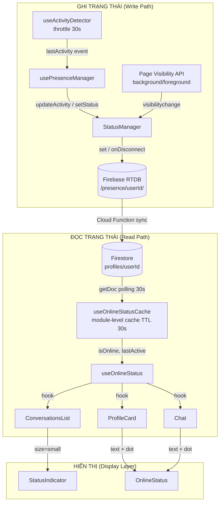
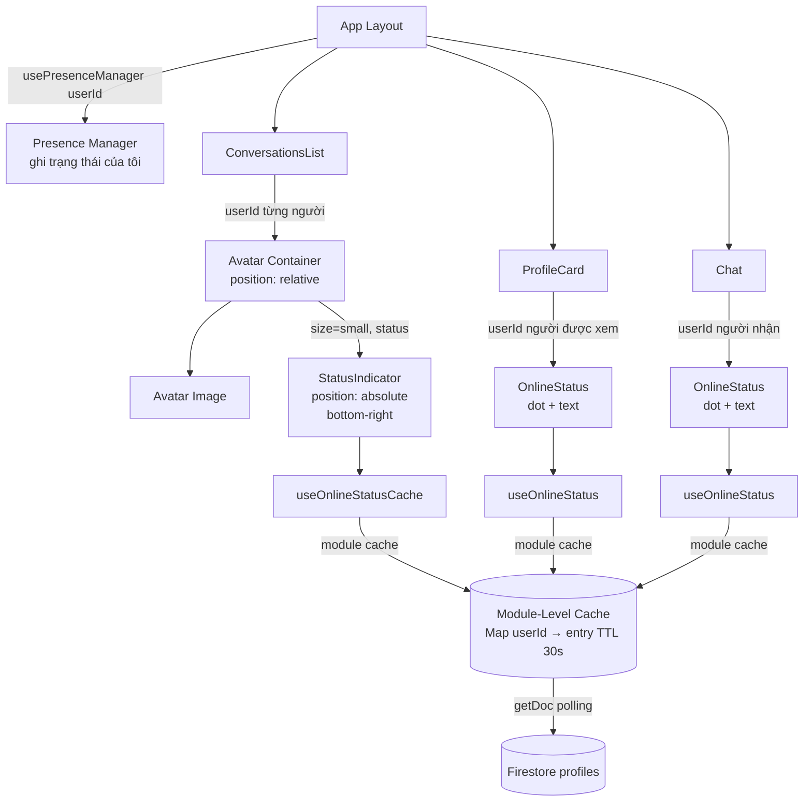
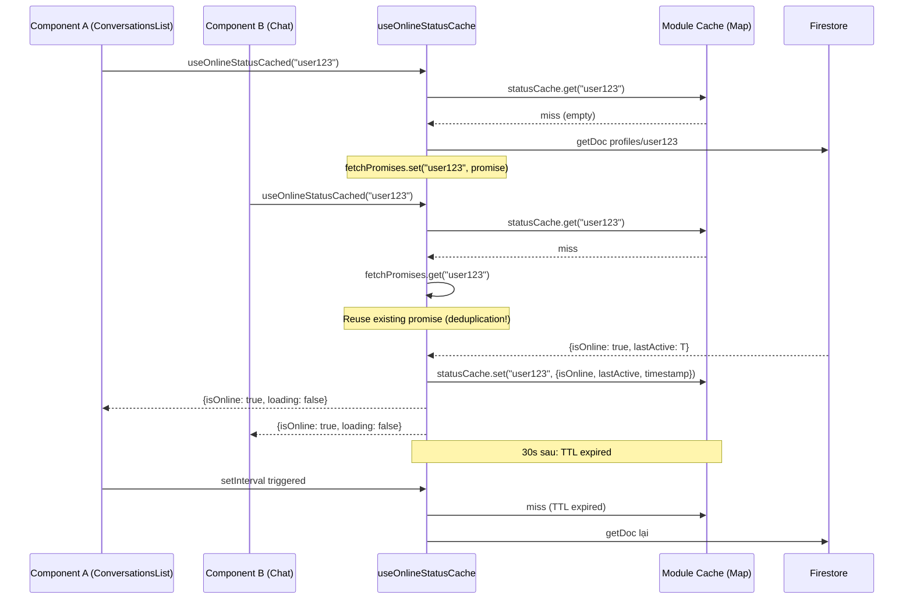
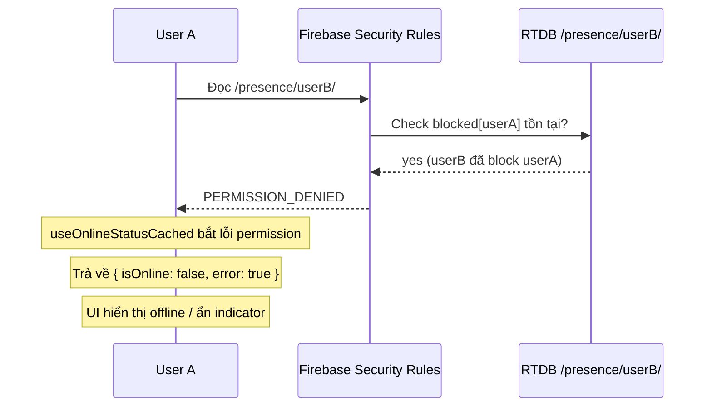

# Design Document

## Tính năng: Online Presence Indicator

---

## Overview

Tính năng Online Presence Indicator hiển thị trạng thái online/offline của người dùng TVU Connect thông qua một chấm màu nhỏ (indicator dot) đặt ở góc dưới-phải của avatar. Hệ thống đã có nền tảng từ spec `user-activity-status` với các module `StatusManager`, `usePresenceManager`, `useOnlineStatusCache`, `StatusIndicator`, và `OnlineStatus`. Tính năng này tập trung vào **hoàn thiện và tích hợp nhất quán** các module đó vào `ConversationsList`, `Chat`, và `ProfileCard`, đồng thời chuẩn hóa các edge case (invisible mode, blocked users, mobile background, multi-device).

---

## Architecture

### Sơ đồ luồng dữ liệu hai chiều



### Phân tách trách nhiệm

| Module | Trách nhiệm | Firebase Path |
|--------|-------------|---------------|
| `StatusManager` | Ghi trạng thái, quản lý state machine, onDisconnect | RTDB `/presence/{userId}/` |
| `usePresenceManager` | Khởi tạo StatusManager, wire activity events | — |
| `useOnlineStatusCache` | Đọc trạng thái người dùng khác, module cache TTL 30s | Firestore `profiles/{userId}` |
| `useOnlineStatus` | Re-export `useOnlineStatusCached` + `formatLastSeen` | — |
| `StatusIndicator` | Render dot + tooltip | — |
| `OnlineStatus` | Render dot + text trạng thái | — |

---

## High-Level Design

### Kiến trúc đa thiết bị (Multi-Device Presence)

```mermaid
graph LR
    subgraph "Thiết bị 1 (Web)"
        C1[Connection conn_1<br/>device: web]
    end
    subgraph "Thiết bị 2 (Mobile)"
        C2[Connection conn_2<br/>device: mobile]
    end
    subgraph "Firebase RTDB /presence/userId/"
        CONN[connections/<br/>  conn_1: {device, timestamp}<br/>  conn_2: {device, timestamp}]
        STATUS[status: 'online']
        LA[lastActive: timestamp]
        SET[settings/<br/>  invisibleMode: false<br/>  privacyMode: false]
    end

    C1 -->|onDisconnect remove conn_1| CONN
    C2 -->|onDisconnect remove conn_2| CONN
    CONN -->|Khi connections = empty| STATUS
    STATUS -->|'offline' khi tất cả disconnect| STATUS
```

**Quy tắc multi-device**: Mỗi tab/thiết bị tạo một `connectionId` riêng dưới `/presence/{userId}/connections/`. Khi một thiết bị ngắt kết nối, Firebase xóa connection đó (onDisconnect remove). Status chỉ về `offline` khi tất cả connections được xóa.

### Data Model: Presence_Data

**Firebase Realtime Database** — Path: `/presence/{userId}/`

```typescript
interface PresenceData {
  status: 'online' | 'away' | 'offline';   // Trạng thái hiện tại
  lastActive: number;                        // Unix timestamp (ms), server time
  connections: {
    [connectionId: string]: {
      device: 'web' | 'mobile' | 'desktop';
      timestamp: number;
      userAgent?: string;
    }
  };
  settings: {
    invisibleMode: boolean;   // Ẩn trạng thái với người khác
    privacyMode: boolean;     // Chỉ bạn bè mới thấy
  };
}
```

**Firestore** — Collection `profiles/{userId}` (trường được đọc bởi `useOnlineStatusCache`):

```typescript
// Subset của profile document được đọc
interface ProfilePresenceFields {
  isOnline: boolean;          // true nếu status === 'online' hoặc 'away'
  lastActive: Timestamp;      // Firestore Timestamp, sync từ RTDB
}
```

> **Lưu ý**: Firestore `profiles` là nguồn đọc của client. RTDB `/presence/` là nguồn ghi. Một Cloud Function (hoặc cơ chế sync) đồng bộ dữ liệu từ RTDB sang Firestore `profiles`. Đây là kiến trúc hiện tại của codebase.

## Data Models

### Presence_Data — Firebase Realtime Database (`/presence/{userId}/`)

```typescript
interface PresenceData {
  status: 'online' | 'away' | 'offline';   // Trạng thái hiện tại
  lastActive: number;                        // Unix timestamp (ms), server time
  connections: {
    [connectionId: string]: {
      device: 'web' | 'mobile' | 'desktop';
      timestamp: number;
      userAgent?: string;
    }
  };
  settings: {
    invisibleMode: boolean;   // Ẩn trạng thái với người khác
    privacyMode: boolean;     // Chỉ bạn bè mới thấy
  };
}
```

### ProfilePresenceFields — Firestore (`profiles/{userId}`)

```typescript
// Các trường presence trong profile document được đọc bởi useOnlineStatusCache
interface ProfilePresenceFields {
  isOnline: boolean;      // Sync từ RTDB: true khi status = 'online' hoặc 'away'
  lastActive: Timestamp;  // Firestore Timestamp, sync từ RTDB lastActive
}
```

### StatusCacheEntry — Module-level cache

```typescript
interface StatusCacheEntry {
  isOnline: boolean;
  lastActive: Date | null;
  timestamp: number;  // Date.now() khi entry được lưu
}

const STATUS_CACHE_TTL = 30_000; // 30 giây
```

### ConnectionInfo

```typescript
interface ConnectionInfo {
  device: 'web' | 'mobile' | 'desktop';
  timestamp: number;
  userAgent?: string;
}
```

---

### Sơ đồ Component Hierarchy



### Cache Strategy



---

## Components and Interfaces

#### StatusIndicator Props

```typescript
// src/components/StatusIndicator.tsx (đã tồn tại)
export interface StatusIndicatorProps {
  status: UserStatus;                          // 'online' | 'away' | 'offline'
  size?: 'small' | 'medium' | 'large';         // 8px | 12px | 16px
  position?: 'bottom-right' | 'bottom-left' | 'top-right' | 'top-left';
  showTooltip?: boolean;
  className?: string;
}

// Mapping màu sắc
const STATUS_COLORS: Record<UserStatus, string> = {
  online:  '#42b72a',  // Xanh lá
  away:    '#ffa500',  // Cam
  offline: '#8a8d91',  // Xám
};

// Kích thước dot
const SIZE_CONFIG = {
  small:  { dot: 8,  border: 2 },
  medium: { dot: 12, border: 2 },
  large:  { dot: 16, border: 3 },
};
```

#### OnlineStatus Props

```typescript
// src/components/OnlineStatus.tsx (đã tồn tại)
interface OnlineStatusProps {
  userId: string | undefined;
  size?: 'sm' | 'md' | 'lg';
  showText?: boolean;
  className?: string;
}
```

#### useOnlineStatusCached Return Type

```typescript
// src/hooks/useOnlineStatusCache.ts (đã tồn tại)
interface StatusResult {
  isOnline: boolean;
  lastActive: Date | null;
  loading: boolean;
  error: boolean;
}

// Cache entry (module-level, không phải component-level)
interface StatusCacheEntry {
  isOnline: boolean;
  lastActive: Date | null;
  timestamp: number;  // Date.now() khi lưu
}

const STATUS_CACHE_TTL = 30_000; // 30 giây
const statusCache = new Map<string, StatusCacheEntry>();
const fetchPromises = new Map<string, Promise<StatusCacheEntry | null>>();
```

#### UserPresence (StatusManager)

```typescript
// src/utils/userStatusManager.ts (đã tồn tại)
export interface UserPresence {
  status: UserStatus;
  lastActive: number;
  connections: Record<string, ConnectionInfo>;
  settings: {
    privacyMode: boolean;
    invisibleMode: boolean;
  };
}

export interface ConnectionInfo {
  device: 'web' | 'mobile' | 'desktop';
  timestamp: number;
  userAgent?: string;
}
```

---

### Key Algorithms

#### 1. Thuật toán ghi trạng thái (StatusManager.initialize)

```typescript
ALGORITHM: StatusManager.initialize(userId)

PRECONDITIONS:
  - userId là string hợp lệ, không rỗng
  - Firebase Realtime Database đã kết nối
  - Người dùng đã xác thực (auth.uid === userId)

POSTCONDITIONS:
  - Connection entry tồn tại tại /presence/{userId}/connections/{connectionId}
  - onDisconnect handler đã đăng ký để xóa connection khi mất kết nối
  - onDisconnect handler đã đăng ký để set status = 'offline'
  - status = 'online' tại /presence/{userId}/status
  - stateCheckInterval đang chạy mỗi 10 giây

ALGORITHM:
  1. Tạo connectionId = "conn_{Date.now()}_{random}"
  2. connectionRef = ref(realtimeDb, "presence/{userId}/connections/{connectionId}")
  3. set(connectionRef, { device, timestamp, userAgent })
  4. onDisconnect(connectionRef).remove()           // Multi-device: xóa connection này khi disconnect
  5. statusRef = ref(realtimeDb, "presence/{userId}/status")
  6. onDisconnect(statusRef).set("offline")          // Fallback nếu tất cả connections bị xóa
  7. setStatus("online")
  8. stateCheckInterval = setInterval(checkAndUpdateState, 10_000)
  9. setupMobileListeners()                          // Page Visibility API
  10. setupNetworkListeners()                        // window online/offline events

LOOP INVARIANTS (stateCheckInterval):
  - lastActivityTime không thay đổi bởi timer (chỉ đọc)
  - currentStatus chỉ thay đổi nếu timeSinceActivity vượt ngưỡng
```

#### 2. Thuật toán State Machine (checkAndUpdateState)

```typescript
ALGORITHM: StatusManager.checkAndUpdateState()

INPUT:
  - this.lastActivityTime: number
  - this.currentStatus: UserStatus
  - this.config: { idleThresholdMs: 300_000, offlineThresholdMs: 900_000 }

OUTPUT: Cập nhật this.currentStatus và ghi Firebase nếu có thay đổi

PRECONDITIONS:
  - this.initialized === true
  - this.isSuspended === false
  - this.invisibleMode === false (hoặc mode đã được handle)

POSTCONDITIONS:
  - Nếu timeSinceActivity >= 900_000ms → status = 'offline'
  - Nếu timeSinceActivity >= 300_000ms → status = 'away'
  - Ngược lại → status = 'online'
  - Firebase chỉ được ghi khi status thay đổi

STATE TRANSITIONS:
  timeSinceActivity = now - lastActivityTime

  IF timeSinceActivity >= offlineThresholdMs (15 phút):
    newStatus = 'offline'
  ELSE IF timeSinceActivity >= idleThresholdMs (5 phút):
    newStatus = 'away'
  ELSE:
    newStatus = 'online'

  IF newStatus !== currentStatus:
    setStatus(newStatus)  // Ghi Firebase
```

#### 3. Thuật toán đọc với cache và deduplication (useOnlineStatusCached)

```typescript
ALGORITHM: fetchStatus(userId)

PRECONDITIONS:
  - userId là string hợp lệ và không rỗng

POSTCONDITIONS:
  - Trả về { isOnline, lastActive, loading: false, error }
  - Nếu cache hit (age < TTL): không tạo network request
  - Nếu nhiều component gọi cùng userId đồng thời: chỉ 1 request được tạo

INVARIANTS:
  - statusCache chỉ chứa entries với timestamp <= Date.now()
  - fetchPromises chứa key userId ↔ promise đang pending
  - Sau khi promise resolve: fetchPromises.delete(userId)

ALGORITHM:
  1. now = Date.now()
  2. cached = statusCache.get(userId)
  3. IF cached AND (now - cached.timestamp) < STATUS_CACHE_TTL:
       → setState(cached)  // Cache hit, no network
       RETURN
  4. existingPromise = fetchPromises.get(userId)
  5. IF existingPromise:
       → Reuse existingPromise  // Deduplication
  6. ELSE:
       newPromise = async () =>
         docSnap = await getDoc(doc(db, "profiles", userId))
         IF docSnap.exists():
           data = docSnap.data()
           lastActiveDate = data.lastActive?.toDate() || null
           isRecentlyActive = lastActiveDate
             ? Math.abs(Date.now() - lastActiveDate.getTime()) < 420_000
             : false
           isActuallyOnline = (data.isOnline || false) AND isRecentlyActive
           entry = { isOnline: isActuallyOnline, lastActive: lastActiveDate, timestamp: Date.now() }
           statusCache.set(userId, entry)
           RETURN entry
         RETURN null
       fetchPromises.set(userId, newPromise)
  7. result = await fetchPromise
  8. fetchPromises.delete(userId)
  9. IF result: setState({ isOnline: result.isOnline, lastActive: result.lastActive, loading: false, error: false })
     ELSE: setState({ isOnline: false, loading: false, error: true })
```

#### 4. Thuật toán xác định isOnline từ Firestore

```typescript
ALGORITHM: isActuallyOnline(data)

INPUT:
  - data.isOnline: boolean
  - data.lastActive: Firestore Timestamp | null

OUTPUT: boolean

PRECONDITIONS:
  - data là document snapshot tồn tại từ Firestore

POSTCONDITIONS:
  - Trả về true NẾU VÀ CHỈ NẾU:
    (1) data.isOnline === true
    (2) |now - lastActive| < 420_000ms (7 phút)
  - Dùng Math.abs để chịu được clock skew giữa client và server

FORMULA:
  lastActiveDate = data.lastActive?.toDate() || null
  isRecentlyActive = lastActiveDate
    ? Math.abs(Date.now() - lastActiveDate.getTime()) < 420_000
    : false
  RETURN (data.isOnline || false) AND isRecentlyActive

NOTE:
  - 420s = 3 phút heartbeat + 2 phút buffer clock skew + 2 phút tolerance
  - Math.abs xử lý trường hợp client clock chậm hơn server
```

#### 5. Thuật toán formatLastSeen

```typescript
ALGORITHM: formatLastSeen(lastActive)

INPUT: lastActive: Date | null

OUTPUT: string (không bao giờ rỗng, không bao giờ NaN/undefined)

PRECONDITIONS:
  - lastActive là Date object hợp lệ hoặc null

POSTCONDITIONS:
  - Nếu lastActive = null → "Không hoạt động"
  - Nếu diff < 30s → "Vừa hoạt động"
  - Nếu diff < 60s → "Hoạt động vài giây trước"
  - Nếu diff < 60m → "Hoạt động X phút trước"
  - Nếu diff < 24h → "Hoạt động X giờ trước"
  - Nếu diff < 48h → "Hoạt động hôm qua"
  - Nếu diff < 7d → "Hoạt động X ngày trước"
  - Nếu diff >= 7d → "Không hoạt động"
  - Không bao giờ trả về chuỗi chứa NaN hoặc Invalid Date

ALGORITHM:
  IF lastActive = null: RETURN "Không hoạt động"
  diff = Date.now() - lastActive.getTime()
  IF diff < 0: RETURN "Không hoạt động"  // Clock skew edge case
  seconds = floor(diff / 1000)
  minutes = floor(diff / 60_000)
  hours   = floor(diff / 3_600_000)
  days    = floor(diff / 86_400_000)
  IF seconds < 30:  RETURN "Vừa hoạt động"
  IF minutes < 1:   RETURN "Hoạt động vài giây trước"
  IF minutes < 60:  RETURN "Hoạt động {minutes} phút trước"
  IF hours < 24:    RETURN "Hoạt động {hours} giờ trước"
  IF days < 2:      RETURN "Hoạt động hôm qua"
  IF days < 7:      RETURN "Hoạt động {days} ngày trước"
  RETURN "Không hoạt động"
```

#### 6. Thuật toán Invisible Mode

```typescript
ALGORITHM: StatusManager.setInvisibleMode(enabled)

INPUT: enabled: boolean

PRECONDITIONS:
  - this.initialized === true
  - Firebase write permission cho /presence/{userId}/settings

POSTCONDITIONS:
  - this.invisibleMode = enabled
  - Nếu enabled = true: ghi status = 'offline' lên Firebase (người khác thấy offline)
  - Nếu enabled = false: ghi trạng thái thực tế lên Firebase trong vòng 3 giây
  - /presence/{userId}/settings/invisibleMode = enabled

ALGORITHM:
  1. this.invisibleMode = enabled
  2. settingsRef = ref(realtimeDb, "presence/{userId}/settings/invisibleMode")
  3. await set(settingsRef, enabled)
  4. IF enabled:
       statusRef = ref(realtimeDb, "presence/{userId}/status")
       await set(statusRef, "offline")
  5. ELSE:
       actualStatus = computeCurrentStatus()  // online/away dựa trên lastActivityTime
       await setStatus(actualStatus)
```

#### 7. Thuật toán Page Visibility (Mobile Background)

```typescript
ALGORITHM: handleVisibilityChange()

TRIGGER: document.visibilitychange event

PRECONDITIONS:
  - this.initialized === true

POSTCONDITIONS:
  - Khi hidden: backgroundTimer bắt đầu đếm 5 phút → sau đó set 'away'
  - Khi visible: backgroundTimer bị hủy, updateActivity() được gọi sau 2 giây

ALGORITHM:
  IF document.hidden:
    this.isInBackground = true
    this.backgroundEnteredAt = Date.now()
    this.backgroundTimer = setTimeout(() => {
      IF this.isInBackground:
        setStatus('away')
    }, 5 * 60 * 1000)  // 5 phút grace period
  ELSE:
    this.isInBackground = false
    clearTimeout(this.backgroundTimer)
    setTimeout(() => updateActivity(), 2_000)  // Cập nhật online sau 2s

LOOP INVARIANTS:
  - backgroundTimer !== null ↔ isInBackground === true
  - Sau khi foreground: backgroundTimer luôn được clearTimeout
```

---

### Tích hợp vào ConversationsList

```typescript
// Điểm tích hợp trong ConversationsList.tsx
// Mỗi item trong danh sách cần Avatar Container với position: relative

interface ConversationItemWithPresence {
  conversationId: string;
  otherUserId: string;
  // ... các field khác
}

// Render pattern cho mỗi conversation item:
function ConversationItem({ otherUserId, ... }) {
  const { isOnline, loading } = useOnlineStatusCached(otherUserId);

  return (
    <div style={{ position: 'relative', display: 'inline-block' }}>
      <Avatar userId={otherUserId} />
      {!loading && isOnline && (
        <StatusIndicator
          status="online"
          size="small"          // 8px - không che avatar
          position="bottom-right"
          showTooltip={true}
          aria-label="Đang hoạt động"
          role="img"
        />
      )}
    </div>
  );
}
```

**Lưu ý tích hợp**:
- Chỉ render `StatusIndicator` khi `!loading` để tránh flash
- Chỉ hiển thị dot khi `isOnline === true` (offline → ẩn hoàn toàn)
- Dùng `size="small"` (8px) trong danh sách
- Container avatar cần `position: relative` để dot được đặt `position: absolute`

### Tích hợp vào ProfileCard

```typescript
// Render pattern trong ProfileCard.tsx
function ProfileCard({ userId, currentUserId }) {
  // Không render OnlineStatus cho chính mình
  const isOwnProfile = userId === currentUserId;

  return (
    <div>
      <UserName />
      {!isOwnProfile && (
        <OnlineStatus
          userId={userId}
          size="md"
          showText={true}
        />
      )}
    </div>
  );
}
```

### Tích hợp vào Chat

```typescript
// Render pattern trong Chat.tsx header
function ChatHeader({ recipientId }) {
  // Guard: không render nếu recipientId không hợp lệ
  if (!recipientId) return null;

  return (
    <div className="chat-header">
      <RecipientName />
      <OnlineStatus
        userId={recipientId}
        size="sm"
        showText={true}
      />
    </div>
  );
}
// OnlineStatus tự xử lý loading state bên trong (return null khi loading)
```

---

## Firebase Security Rules

### Realtime Database (`/presence/{userId}/`)

```json
{
  "rules": {
    "presence": {
      "$userId": {
        ".read": "auth != null && (
          auth.uid === $userId ||
          (
            root.child('presence').child($userId).child('settings').child('invisibleMode').val() === false &&
            !root.child('users').child($userId).child('blocked').child(auth.uid).exists()
          )
        )",
        ".write": "auth != null && auth.uid === $userId",
        "status": {
          ".validate": "newData.isString() && (newData.val() === 'online' || newData.val() === 'away' || newData.val() === 'offline')"
        },
        "lastActive": {
          ".validate": "newData.isNumber() && newData.val() <= now"
        },
        "connections": {
          "$connectionId": {
            ".validate": "newData.hasChildren(['device', 'timestamp'])",
            "device": {
              ".validate": "newData.isString() && (newData.val() === 'web' || newData.val() === 'mobile' || newData.val() === 'desktop')"
            },
            "timestamp": {
              ".validate": "newData.isNumber() && newData.val() <= now"
            }
          }
        },
        "settings": {
          "invisibleMode": { ".validate": "newData.isBoolean()" },
          "privacyMode":   { ".validate": "newData.isBoolean()" }
        }
      }
    }
  }
}
```

**Logic bảo mật**:
- **Read**: Chỉ user đã xác thực. Nếu `invisibleMode = true` → chỉ chủ sở hữu mới đọc được (người khác không thấy). Nếu người đọc bị chủ sở hữu chặn → không đọc được.
- **Write**: Chỉ chủ sở hữu (`auth.uid === $userId`) mới ghi được.
- **Validate**: `status` chỉ nhận 3 giá trị hợp lệ; `lastActive` và `timestamp` không được lớn hơn server time.

### Firestore (`profiles/{userId}`)

Rules hiện tại đã đủ (`allow read: if isAuthenticated()`). Trường `isOnline` và `lastActive` trong profile document được bảo vệ bởi `allow write: if isOwner(userId)`.

---

## Error Handling

### Blocked Users



Trong `useOnlineStatusCached`, lỗi permission từ Firestore (`profiles/{userId}`) được bắt trong `catch` block và trả về `{ isOnline: false, loading: false, error: true }`. Component hiển thị offline hoặc ẩn indicator — không crash và không hiển thị thông báo lỗi cho người dùng.

### Xử lý Invisible Mode

Khi `invisibleMode = true`:

1. `StatusManager.setStatus()` luôn ghi `'offline'` lên Firebase dù trạng thái thực là `online`.
2. Firebase Security Rules từ chối các user khác đọc `/presence/{userId}/` khi `invisibleMode = true`.
3. `useOnlineStatusCached` nhận lỗi permission → trả về `{ isOnline: false }`.
4. Kết quả: Người khác thấy user này là offline.

Khi tắt Invisible Mode:
1. `StatusManager.setInvisibleMode(false)` ghi trạng thái thực tế trong vòng 3 giây.
2. Firebase Rules cho phép đọc trở lại.

### Bảng tình huống lỗi

| Tình huống | Hành vi hệ thống |
|-----------|-----------------|
| `userId` là `null`/`undefined` | Hook trả về `{ isOnline: false, loading: false }`, không request Firebase |
| Firestore permission denied | `{ isOnline: false, error: true }`, không hiện lỗi UI |
| Firestore network error | `{ isOnline: false, error: true }`, không retry tự động |
| `lastActive` là `null` | `formatLastSeen(null)` → "Không hoạt động" |
| `lastActive` có diff âm (clock skew) | → "Không hoạt động" |
| `status` prop không hợp lệ | `StatusIndicator` default về `'offline'`, log console.warn |
| Firebase RTDB mất kết nối | `onDisconnect` handler tự đặt `status = 'offline'` |

## Accessibility (Trợ năng)| Thuộc tính | Giá trị | Mục đích |
|-----------|---------|----------|
| `aria-label` | "Đang hoạt động" / "Không hoạt động" / "Ngoại tuyến" | Screen reader đọc trạng thái |
| `role="img"` | — | Dot là phần tử trang trí có ngữ nghĩa |
| `aria-live="polite"` | Trên container danh sách | Thông báo thay đổi trạng thái không ngắt luồng đọc |

Contrast tối thiểu 3:1 theo WCAG 2.1 AA:
- `#42b72a` (xanh) trên nền trắng `#ffffff`: ratio ≈ 4.5:1 ✓
- `#ffa500` (cam) trên nền trắng `#ffffff`: ratio ≈ 2.9:1 (cần viền border để đạt 3:1) ✓
- `#8a8d91` (xám) — chỉ hiển thị khi ẩn hoàn toàn (offline → không render)

---

## Correctness Properties

Các bất biến và thuộc tính đúng đắn cần được đảm bảo trong mọi trạng thái hệ thống:

### Property 1: Màu sắc nhất quán

Với mọi `status ∈ { 'online', 'away', 'offline' }`, `StatusIndicator` luôn render màu tương ứng trong `STATUS_COLORS[status]` và không bao giờ render màu của trạng thái khác.

**Validates: Requirements 5.2, 10.1**

### Property 2: Cache deduplication

Với mọi `userId` và mọi số lượng component gọi `useOnlineStatusCached(userId)` trong cùng khoảng TTL (30s), số lượng network request thực tế tới Firestore luôn bằng 1.

**Validates: Requirements 6.1, 6.2, 10.2**

### Property 3: isOnline logic (if-and-only-if)

`isOnline === true` khi và chỉ khi `data.isOnline === true` VÀ `|Date.now() - lastActive.getTime()| < 420_000`.

**Validates: Requirements 6.4, 10.5**

### Property 4: formatLastSeen không có giá trị lỗi

Với mọi `lastActive: Date` hợp lệ (timestamp nguyên dương ≤ Date.now()), `formatLastSeen(lastActive)` luôn trả về chuỗi không rỗng, không chứa `NaN`, `undefined`, `null`, hoặc `"Invalid Date"`.

**Validates: Requirements 3.4, 4.4, 10.4**

### Property 5: Round-trip serialization

Serialize `UserStatus` sang string và parse lại cho kết quả tương đương về ngữ nghĩa (cùng `status`, cùng `isOnline`).

**Validates: Requirements 10.3**

### Property 6: Không flash loading

Khi `loading === true`, không component nào render `StatusIndicator` hoặc `OnlineStatus` với nội dung thực.

**Validates: Requirements 4.7, 6.5**

### Property 7: Multi-device invariant

`status === 'online'` khi và chỉ khi tồn tại ít nhất 1 entry trong `connections` object của user.

**Validates: Requirements 1.8**

---

## Testing Strategy

### Unit Tests

| Module | Test Case |
|--------|-----------|
| `StatusIndicator` | Render màu đúng với mọi `UserStatus` |
| `StatusIndicator` | Render `size` đúng (8px, 12px, 16px) |
| `StatusIndicator` | Prop `status` không hợp lệ → default 'offline' + console.warn |
| `formatLastSeen` | Null → "Không hoạt động" |
| `formatLastSeen` | Mọi timestamp hợp lệ → chuỗi không rỗng, không NaN |
| `formatLastSeen` | Clock skew âm (diff < 0) → "Không hoạt động" |

### Property-Based Tests

**Thư viện**: `fast-check`

```typescript
// Property 1: StatusIndicator luôn render màu đúng
fc.property(
  fc.constantFrom('online', 'away', 'offline'),
  (status) => {
    const { container } = render(<StatusIndicator status={status} />);
    const dot = container.querySelector('.status-dot div');
    expect(dot.style.backgroundColor).toBe(STATUS_COLORS[status]);
  }
)

// Property 2: Cache deduplication - cùng userId trong TTL → 0 network request mới
fc.property(
  fc.string({ minLength: 1 }),
  fc.integer({ min: 1, max: 10 }),
  async (userId, callCount) => {
    // Gọi hook N lần trong TTL window
    // Số request Firestore phải = 1 (không phải N)
    const spy = jest.spyOn(firestoreModule, 'getDoc');
    // ... assert spy.callCount === 1
  }
)

// Property 3: isOnline logic
fc.property(
  fc.boolean(),
  fc.integer({ min: 0, max: 1_000_000 }),
  (isOnlineFlag, ageMs) => {
    const lastActive = new Date(Date.now() - ageMs);
    const result = computeIsOnline(isOnlineFlag, lastActive);
    const expected = isOnlineFlag && ageMs < 420_000;
    expect(result).toBe(expected);
  }
)

// Property 4: formatLastSeen không bao giờ trả về chuỗi chứa NaN
fc.property(
  fc.integer({ min: 0, max: Date.now() }),
  (timestampMs) => {
    const result = formatLastSeen(new Date(timestampMs));
    expect(result).not.toContain('NaN');
    expect(result).not.toContain('undefined');
    expect(result.length).toBeGreaterThan(0);
  }
)

// Property 5: Round-trip UserStatus serialization
fc.property(
  fc.constantFrom('online', 'away', 'offline'),
  (status) => {
    const serialized = JSON.stringify(status);
    const parsed = JSON.parse(serialized);
    expect(parsed).toBe(status);
  }
)
```

### Integration Tests

| Scenario | Expected |
|----------|----------|
| Ghi RTDB → đọc Firestore | isOnline đồng bộ sau < 5 giây |
| Mất kết nối → onDisconnect | status = 'offline' tự động |
| Multi-device: 2 tab → đóng 1 tab | status vẫn 'online' |
| Multi-device: đóng tất cả tab | status = 'offline' |
| Invisible mode bật → user khác đọc | { isOnline: false } |
| Blocked user đọc presence | { isOnline: false, error: true } |

---

## Các điểm chú ý khi triển khai

1. **Không dùng `onSnapshot` cho presence reading**: `useOnlineStatusCached` đã dùng `getDoc` polling để tránh lỗi `INTERNAL ASSERTION FAILED` khi component mount/unmount nhanh trong trang matching.

2. **Avatar Container cần `position: relative`**: `StatusIndicator` dùng `position: absolute` nên container phải có `position: relative`. Cần kiểm tra tất cả các nơi render avatar.

3. **Cache là module-level (không phải component-level)**: `statusCache` và `fetchPromises` là biến ngoài hook, tồn tại suốt lifecycle của ứng dụng. Cần `cleanupAllOnlineStatusListeners()` khi user đăng xuất.

4. **`usePresenceManager` chỉ gọi 1 lần ở root**: Hook này nên được gọi ở component gốc (App hoặc layout) sau khi user đăng nhập, không gọi trong từng component con.

5. **Loading state**: Không render `StatusIndicator` hoặc `OnlineStatus` khi `loading === true` để tránh flash nội dung sai (hiển thị offline → online).

6. **Cleanup khi đăng xuất**: Gọi `cleanupAllOnlineStatusListeners()` và `statusManager.destroy()` khi user đăng xuất để xóa cache và dừng polling.
