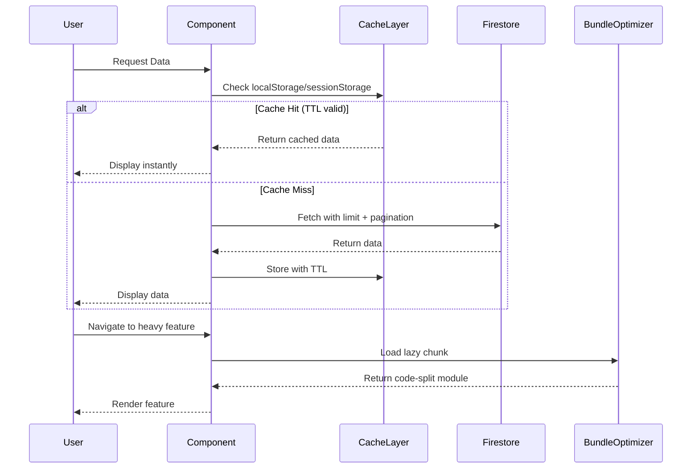

# Design Document: TVU Connect v2.6.0 - Tối ưu hóa toàn diện

## Overview

Tối ưu hóa toàn diện TVU Connect v2.6.0 nhằm giải quyết 4 vấn đề chính: (1) Giảm Firestore Reads từ 80K/ngày xuống <40K/ngày thông qua Cache-First strategy, (2) Giảm Bundle size từ 730KB xuống <500KB bằng Code Splitting và Tree-shaking, (3) Củng cố bảo mật với Anonymity Audit và Single Source of Truth cho state management, (4) Tối ưu trải nghiệm mạng yếu với Skeleton Loading và Image Optimization. Hệ thống sử dụng localStorage/sessionStorage với TTL, React.lazy + Suspense cho 58 components, và debounce/throttle cho search/filter operations.

## Main Algorithm/Workflow



## Core Interfaces/Types

```typescript
// Cache Management
interface CacheConfig {
  key: string;
  ttl: number; // milliseconds
  storage: 'localStorage' | 'sessionStorage';
}

interface CachedData<T> {
  data: T;
  timestamp: number;
  ttl: number;
}

// Firestore Optimization
interface QueryConfig {
  collection: string;
  limit: number;
  orderBy?: { field: string; direction: 'asc' | 'desc' };
  where?: Array<{ field: string; operator: any; value: any }>;
  startAfter?: any;
}

// Code Splitting
interface LazyComponentConfig {
  component: string;
  priority: 'high' | 'medium' | 'low';
  preload?: boolean;
}

// Image Optimization
interface ImageOptimizationConfig {
  maxSizeKB: number;
  maxWidth: number;
  maxHeight: number;
  quality: number;
}
```


## Key Functions with Formal Specifications

### Function 1: getCachedData()

```typescript
function getCachedData<T>(config: CacheConfig): T | null
```

**Preconditions:**
- `config.key` is non-empty string
- `config.storage` is either 'localStorage' or 'sessionStorage'
- Browser supports Web Storage API

**Postconditions:**
- Returns cached data if exists and TTL is valid
- Returns null if cache miss or TTL expired
- No side effects on storage if data is valid
- Removes expired data from storage if TTL invalid

**Loop Invariants:** N/A

### Function 2: setCachedData()

```typescript
function setCachedData<T>(config: CacheConfig, data: T): void
```

**Preconditions:**
- `config.key` is non-empty string
- `config.ttl` is positive integer
- `data` is serializable to JSON
- Storage has available space

**Postconditions:**
- Data is stored in specified storage with timestamp
- TTL is stored alongside data
- Previous data with same key is overwritten
- Throws error if storage quota exceeded

**Loop Invariants:** N/A

### Function 3: optimizeFirestoreQuery()

```typescript
function optimizeFirestoreQuery(config: QueryConfig): Query
```

**Preconditions:**
- `config.collection` exists in Firestore
- `config.limit` is positive integer ≤ 100
- Required composite indexes are deployed

**Postconditions:**
- Returns Firestore Query with applied optimizations
- Query includes limit clause
- Query includes orderBy if specified
- Query includes where clauses if specified
- Query uses composite indexes for performance

**Loop Invariants:** N/A

### Function 4: compressImage()

```typescript
async function compressImage(file: File, config: ImageOptimizationConfig): Promise<Blob>
```

**Preconditions:**
- `file` is valid image file (JPEG, PNG, WebP)
- `config.maxSizeKB` is positive integer
- `config.quality` is between 0 and 1
- Browser supports Canvas API

**Postconditions:**
- Returns compressed image blob
- Blob size ≤ config.maxSizeKB (or best effort)
- Image dimensions ≤ config.maxWidth and config.maxHeight
- Image quality is config.quality
- Original file is not modified

**Loop Invariants:** 
- During compression iterations: Image quality decreases monotonically
- During resize: Aspect ratio is preserved


## Algorithmic Pseudocode

### Main Caching Algorithm

```typescript
ALGORITHM fetchWithCache(config: QueryConfig, cacheConfig: CacheConfig)
INPUT: config (query configuration), cacheConfig (cache settings)
OUTPUT: data (query results)

BEGIN
  // Step 1: Check cache first
  cachedData ← getCachedData(cacheConfig)
  
  IF cachedData IS NOT NULL THEN
    RETURN cachedData
  END IF
  
  // Step 2: Cache miss - fetch from Firestore
  query ← optimizeFirestoreQuery(config)
  data ← await executeQuery(query)
  
  // Step 3: Store in cache
  setCachedData(cacheConfig, data)
  
  RETURN data
END
```

**Preconditions:**
- config and cacheConfig are valid
- Firestore connection is available

**Postconditions:**
- Data is returned from cache or Firestore
- Fresh data is cached with TTL
- Firestore reads are minimized

**Loop Invariants:** N/A

### Pagination Algorithm

```typescript
ALGORITHM loadNextPage(currentData: T[], lastDoc: DocumentSnapshot, limit: number)
INPUT: currentData (existing data), lastDoc (cursor), limit (page size)
OUTPUT: newData (combined data), newLastDoc (new cursor), hasMore (boolean)

BEGIN
  // Step 1: Build paginated query
  query ← buildQuery()
    .orderBy('createdAt', 'desc')
    .limit(limit)
    .startAfter(lastDoc)
  
  // Step 2: Execute query
  snapshot ← await executeQuery(query)
  
  // Step 3: Extract data
  newItems ← []
  FOR EACH doc IN snapshot.docs DO
    newItems.push(doc.data())
  END FOR
  
  // Step 4: Determine if more data exists
  hasMore ← snapshot.docs.length === limit
  newLastDoc ← snapshot.docs[snapshot.docs.length - 1]
  
  // Step 5: Combine with existing data
  newData ← currentData.concat(newItems)
  
  RETURN (newData, newLastDoc, hasMore)
END
```

**Preconditions:**
- currentData is valid array
- lastDoc is valid DocumentSnapshot or null
- limit is positive integer

**Postconditions:**
- newData contains all previous + new items
- newLastDoc points to last fetched document
- hasMore indicates if more pages exist
- No duplicate items in newData

**Loop Invariants:**
- All items in newItems are unique
- Order is maintained (newest first)


### Debounce Algorithm for Search

```typescript
ALGORITHM debounceSearch(searchTerm: string, delay: number)
INPUT: searchTerm (user input), delay (milliseconds)
OUTPUT: debouncedResults (search results)

BEGIN
  // Step 1: Clear existing timer
  IF timer IS NOT NULL THEN
    clearTimeout(timer)
  END IF
  
  // Step 2: Set new timer
  timer ← setTimeout(() => {
    // Step 3: Check cache first
    cacheKey ← 'search:' + searchTerm
    cached ← getCachedData({ key: cacheKey, ttl: 300000, storage: 'sessionStorage' })
    
    IF cached IS NOT NULL THEN
      RETURN cached
    END IF
    
    // Step 4: Execute search query
    query ← buildSearchQuery(searchTerm)
      .limit(20)
    
    results ← await executeQuery(query)
    
    // Step 5: Cache results
    setCachedData({ key: cacheKey, ttl: 300000, storage: 'sessionStorage' }, results)
    
    RETURN results
  }, delay)
END
```

**Preconditions:**
- searchTerm is string (may be empty)
- delay is positive integer (typically 300-500ms)

**Postconditions:**
- Search executes only after user stops typing for delay ms
- Results are cached for 5 minutes
- Previous pending searches are cancelled
- Firestore reads are minimized

**Loop Invariants:** N/A

### Code Splitting Loader Algorithm

```typescript
ALGORITHM loadLazyComponent(componentName: string)
INPUT: componentName (component identifier)
OUTPUT: Component (React component)

BEGIN
  // Step 1: Check if already loaded
  IF componentCache.has(componentName) THEN
    RETURN componentCache.get(componentName)
  END IF
  
  // Step 2: Load component dynamically
  Component ← await import(`./components/${componentName}.tsx`)
  
  // Step 3: Cache loaded component
  componentCache.set(componentName, Component)
  
  // Step 4: Return default export
  RETURN Component.default
END
```

**Preconditions:**
- componentName is valid component file name
- Component file exists in components directory
- Component has default export

**Postconditions:**
- Component is loaded asynchronously
- Loaded component is cached in memory
- Subsequent loads return cached component
- Bundle size is reduced by lazy loading

**Loop Invariants:** N/A


## Example Usage

### Example 1: Cache-First Data Fetching

```typescript
// Hook: useCachedPosts.ts
import { useState, useEffect } from 'react';
import { fetchWithCache } from '../utils/cacheManager';

export function useCachedPosts() {
  const [posts, setPosts] = useState([]);
  const [loading, setLoading] = useState(true);
  
  useEffect(() => {
    const loadPosts = async () => {
      const data = await fetchWithCache(
        {
          collection: 'posts',
          limit: 10,
          orderBy: { field: 'createdAt', direction: 'desc' }
        },
        {
          key: 'posts:feed',
          ttl: 60000, // 60 seconds
          storage: 'sessionStorage'
        }
      );
      
      setPosts(data);
      setLoading(false);
    };
    
    loadPosts();
  }, []);
  
  return { posts, loading };
}
```

### Example 2: Code Splitting with React.lazy

```typescript
// App.tsx
import React, { Suspense, lazy } from 'react';
import SkeletonLoader from './components/SkeletonLoader';

// Lazy load heavy components
const Explore = lazy(() => import('./components/Explore'));
const Matching = lazy(() => import('./components/Matching'));

function App() {
  return (
    <Suspense fallback={<SkeletonLoader />}>
      <Routes>
        <Route path="/explore" element={<Explore />} />
        <Route path="/matching" element={<Matching />} />
      </Routes>
    </Suspense>
  );
}
```

### Example 3: Debounced Search

```typescript
// SearchBar.tsx
import { useState, useCallback } from 'react';
import { debounce } from '../utils/debounce';

function SearchBar() {
  const [results, setResults] = useState([]);
  
  const debouncedSearch = useCallback(
    debounce(async (term: string) => {
      const data = await fetchWithCache(
        {
          collection: 'profiles',
          limit: 20,
          where: [{ field: 'displayName', operator: '>=', value: term }]
        },
        {
          key: `search:${term}`,
          ttl: 300000, // 5 minutes
          storage: 'sessionStorage'
        }
      );
      setResults(data);
    }, 300),
    []
  );
  
  return (
    <input
      type="text"
      onChange={(e) => debouncedSearch(e.target.value)}
      placeholder="Tìm kiếm..."
    />
  );
}
```

### Example 4: Image Optimization

```typescript
// ImageUpload.tsx
import { compressImage } from '../utils/imageOptimization';

async function handleImageUpload(file: File) {
  // Client-side validation
  if (file.size > 800 * 1024) {
    throw new Error('File quá lớn (>800KB)');
  }
  
  // Compress image
  const compressed = await compressImage(file, {
    maxSizeKB: 800,
    maxWidth: 1920,
    maxHeight: 1080,
    quality: 0.8
  });
  
  // Upload compressed image
  await uploadToStorage(compressed);
}
```


## Correctness Properties

### Property 1: Cache Consistency
```typescript
∀ key, data, ttl:
  setCachedData(key, data, ttl) ⟹
  (getCachedData(key) = data) ∧ (timestamp < now + ttl)
```
Khi data được cache, nó phải được trả về chính xác cho đến khi TTL hết hạn.

### Property 2: TTL Expiration
```typescript
∀ key, data, ttl:
  setCachedData(key, data, ttl) ∧ (now > timestamp + ttl) ⟹
  getCachedData(key) = null
```
Sau khi TTL hết hạn, cache phải trả về null và xóa data cũ.

### Property 3: Firestore Read Reduction
```typescript
∀ query, cacheConfig:
  cacheHit(query, cacheConfig) ⟹
  firestoreReads(query) = 0
```
Khi cache hit, không có Firestore read nào được thực hiện.

### Property 4: Pagination Uniqueness
```typescript
∀ page1, page2:
  loadNextPage(page1) ∧ loadNextPage(page2) ⟹
  page1 ∩ page2 = ∅
```
Các trang pagination không được chứa documents trùng lặp.

### Property 5: Debounce Cancellation
```typescript
∀ search1, search2, delay:
  debounce(search1, delay) ∧ debounce(search2, delay) ∧ (time(search2) < time(search1) + delay) ⟹
  cancelled(search1) = true
```
Khi user nhập liên tục, chỉ search cuối cùng được thực hiện.

### Property 6: Code Splitting Isolation
```typescript
∀ component:
  lazy(component) ⟹
  (initialBundle ∌ component) ∧ (loadOnDemand(component) = true)
```
Lazy components không được bao gồm trong initial bundle và chỉ load khi cần.

### Property 7: Image Size Constraint
```typescript
∀ image, config:
  compressImage(image, config) ⟹
  size(result) ≤ config.maxSizeKB
```
Ảnh sau khi compress phải nhỏ hơn hoặc bằng maxSizeKB.

### Property 8: Listener Cleanup
```typescript
∀ listener:
  componentUnmount() ⟹
  unsubscribe(listener) = true
```
Khi component unmount, tất cả listeners phải được unsubscribe.

### Property 9: Cache Storage Limit
```typescript
∀ storage:
  size(storage) > quota ⟹
  evictOldest(storage) ∨ throwError()
```
Khi storage đầy, phải evict entries cũ nhất hoặc throw error.

### Property 10: Query Limit Enforcement
```typescript
∀ query:
  optimizeQuery(query) ⟹
  limit(query) ≤ 100
```
Mọi query đều phải có limit ≤ 100 để tránh over-fetching.


## Error Handling

### Error Scenario 1: Storage Quota Exceeded

**Condition:** localStorage/sessionStorage đầy (thường 5-10MB limit)
**Response:** 
- Catch QuotaExceededError
- Evict 20% oldest cache entries
- Retry setCachedData
- Log warning to console

**Recovery:**
```typescript
try {
  setCachedData(config, data);
} catch (error) {
  if (error.name === 'QuotaExceededError') {
    evictOldestEntries(0.2); // Remove 20% oldest
    setCachedData(config, data); // Retry
  }
}
```

### Error Scenario 2: Firestore Permission Denied

**Condition:** User không có quyền đọc collection
**Response:**
- Return empty array
- Show user-friendly error message
- Log error to monitoring system
- Don't cache error response

**Recovery:**
```typescript
try {
  const data = await executeQuery(query);
  return data;
} catch (error) {
  if (error.code === 'permission-denied') {
    showToast('Bạn không có quyền truy cập dữ liệu này');
    return [];
  }
  throw error;
}
```

### Error Scenario 3: Network Timeout

**Condition:** Firestore query timeout (>10s)
**Response:**
- Return cached data if available (stale-while-revalidate)
- Show "Đang tải chậm" indicator
- Retry with exponential backoff
- Max 3 retries

**Recovery:**
```typescript
async function fetchWithRetry(query, maxRetries = 3) {
  for (let i = 0; i < maxRetries; i++) {
    try {
      return await executeQuery(query);
    } catch (error) {
      if (i === maxRetries - 1) throw error;
      await sleep(Math.pow(2, i) * 1000); // Exponential backoff
    }
  }
}
```

### Error Scenario 4: Code Splitting Load Failure

**Condition:** Lazy component chunk load failed (network error, 404)
**Response:**
- Show error boundary with retry button
- Log error to Sentry/monitoring
- Provide fallback UI
- Clear service worker cache if exists

**Recovery:**
```typescript
<ErrorBoundary
  fallback={({ error, retry }) => (
    <div>
      <p>Không thể tải tính năng này</p>
      <button onClick={retry}>Thử lại</button>
    </div>
  )}
>
  <Suspense fallback={<SkeletonLoader />}>
    <LazyComponent />
  </Suspense>
</ErrorBoundary>
```

### Error Scenario 5: Image Compression Failure

**Condition:** Canvas API không khả dụng hoặc file corrupt
**Response:**
- Upload original file if size < 800KB
- Reject upload if size > 800KB
- Show clear error message
- Suggest image format/size requirements

**Recovery:**
```typescript
try {
  const compressed = await compressImage(file, config);
  return compressed;
} catch (error) {
  if (file.size < 800 * 1024) {
    console.warn('Compression failed, uploading original');
    return file;
  }
  throw new Error('File quá lớn và không thể nén. Vui lòng chọn ảnh nhỏ hơn 800KB.');
}
```


## Testing Strategy

### Unit Testing Approach

**Cache Manager Tests:**
- Test setCachedData stores data correctly
- Test getCachedData returns data within TTL
- Test getCachedData returns null after TTL expires
- Test cache eviction when storage full
- Test cache invalidation

**Query Optimizer Tests:**
- Test query building with limits
- Test pagination with startAfter
- Test filter application
- Test composite index usage
- Mock Firestore SDK

**Image Compression Tests:**
- Test compression reduces file size
- Test aspect ratio preservation
- Test quality settings
- Test error handling for invalid files
- Use Canvas mock

**Debounce Tests:**
- Test function calls are delayed
- Test previous calls are cancelled
- Test final call executes
- Use fake timers (vi.useFakeTimers)

### Property-Based Testing Approach

**Property Test Library:** fast-check (already in devDependencies)

**Property Tests:**

1. Cache TTL Property:
```typescript
import fc from 'fast-check';

test('cached data expires after TTL', () => {
  fc.assert(
    fc.property(
      fc.string(), // key
      fc.anything(), // data
      fc.integer({ min: 100, max: 5000 }), // ttl
      (key, data, ttl) => {
        setCachedData({ key, ttl, storage: 'sessionStorage' }, data);
        
        // Immediately should return data
        expect(getCachedData({ key, ttl, storage: 'sessionStorage' })).toEqual(data);
        
        // After TTL should return null
        vi.advanceTimersByTime(ttl + 1);
        expect(getCachedData({ key, ttl, storage: 'sessionStorage' })).toBeNull();
      }
    )
  );
});
```

2. Pagination Uniqueness Property:
```typescript
test('pagination returns unique documents', () => {
  fc.assert(
    fc.property(
      fc.array(fc.record({ id: fc.string(), data: fc.anything() })),
      fc.integer({ min: 1, max: 20 }),
      (documents, pageSize) => {
        const pages = paginateDocuments(documents, pageSize);
        const allIds = pages.flat().map(doc => doc.id);
        const uniqueIds = new Set(allIds);
        
        // No duplicates across pages
        expect(allIds.length).toBe(uniqueIds.size);
      }
    )
  );
});
```

3. Image Compression Property:
```typescript
test('compressed image is smaller than original', () => {
  fc.assert(
    fc.property(
      fc.integer({ min: 100, max: 2000 }), // width
      fc.integer({ min: 100, max: 2000 }), // height
      fc.double({ min: 0.1, max: 1.0 }), // quality
      async (width, height, quality) => {
        const original = createMockImage(width, height);
        const compressed = await compressImage(original, {
          maxSizeKB: 500,
          maxWidth: 1920,
          maxHeight: 1080,
          quality
        });
        
        expect(compressed.size).toBeLessThanOrEqual(original.size);
      }
    )
  );
});
```

### Integration Testing Approach

**End-to-End Cache Flow:**
- Test full flow: cache miss → Firestore fetch → cache set → cache hit
- Verify Firestore reads count
- Verify cache hit rate
- Test across component lifecycle

**Code Splitting Integration:**
- Test lazy components load correctly
- Test Suspense fallback displays
- Test error boundaries catch load failures
- Test navigation between lazy routes

**Real User Scenarios:**
- Test feed loading with pagination
- Test search with debounce
- Test image upload with compression
- Test offline → online transition
- Measure performance metrics (LCP, FID, CLS)


## Performance Considerations

### Firestore Read Reduction Targets

**Current State (80K reads/day):**
- Posts Feed: ~25K reads/day (no cache, frequent refreshes)
- Matching: ~20K reads/day (re-fetching same profiles)
- Messages: ~15K reads/day (multiple listeners)
- Explore Places: ~10K reads/day (no cache)
- Profiles: ~10K reads/day (duplicate fetches)

**Target State (<40K reads/day):**
- Posts Feed: ~8K reads/day (60s cache, pagination)
- Matching: ~6K reads/day (24h viewed cache, batch operations)
- Messages: ~5K reads/day (single listener, 120s cache)
- Explore Places: ~3K reads/day (300s cache)
- Profiles: ~3K reads/day (180s cache, batch fetching)

**Optimization Strategies:**
1. Cache-First: Check localStorage/sessionStorage before Firestore
2. Pagination: Load 10-20 items at a time, not all
3. Debounce: 300ms delay for search, 500ms for filters
4. Listener Optimization: Single listener per conversation, auto-cleanup
5. Batch Operations: Group writes in batches of 10

### Bundle Size Reduction Targets

**Current State (730KB):**
- react + react-dom: ~140KB
- firebase: ~180KB
- leaflet + react-leaflet: ~150KB (Explore only)
- lucide-react: ~80KB (importing all icons)
- Other dependencies: ~180KB

**Target State (<500KB):**
- Initial Bundle: ~280KB (core only)
  - react + react-dom: ~140KB
  - firebase/auth + firebase/firestore: ~100KB (tree-shaken)
  - lucide-react: ~20KB (named imports only)
  - Core components: ~20KB
- Lazy Chunks:
  - Explore: ~150KB (leaflet + MapView)
  - Matching: ~30KB
  - AI Assistant: ~50KB

**Code Splitting Strategy:**
```typescript
// High Priority (load immediately)
- Auth, Feed, Navigation, SkeletonLoader

// Medium Priority (lazy load, preload on idle)
- Matching, Messages, Profile

// Low Priority (lazy load on demand)
- Explore (has Leaflet), Settings, AI Assistant
```

### Memory Management

**Cache Size Limits:**
- sessionStorage: Max 5MB total
  - Posts cache: Max 1MB (~100 posts)
  - Search cache: Max 500KB
  - Profiles cache: Max 1MB
  - Places cache: Max 500KB
- localStorage: Max 5MB total
  - User preferences: ~10KB
  - Viewed profiles (Matching): Max 2MB
  - Persistent settings: ~10KB

**Eviction Strategy:**
- LRU (Least Recently Used) for cache entries
- Auto-evict when storage > 80% full
- Clear all caches on logout

### Network Optimization for 3G

**Skeleton Loading:**
- Show skeleton for PostCard (200ms delay)
- Show skeleton for PlaceList (300ms delay)
- Prevent layout shift (CLS)

**Progressive Loading:**
- Load text content first
- Load images lazily (Intersection Observer)
- Load comments on demand (click to expand)
- Defer non-critical features (reactions, analytics)

**Image Optimization:**
- Client-side validation: Max 800KB
- Canvas resize: Max 1920x1080
- Quality: 0.8 for photos, 0.9 for screenshots
- Format: WebP if supported, fallback to JPEG


## Security Considerations

### Single Source of Truth for State Management

**Current Issues:**
- Profile state scattered across multiple components
- Online status has duplicate listeners
- Potential race conditions on state updates

**Refactoring Strategy:**

1. **Profile State:**
```typescript
// Create ProfileContext
const ProfileContext = createContext<ProfileState>(null);

// Single source of truth
function ProfileProvider({ children }) {
  const [profile, setProfile] = useState(null);
  const [loading, setLoading] = useState(true);
  
  // Centralized profile fetching with cache
  const fetchProfile = useCallback(async (uid) => {
    const cached = getCachedData({ key: `profile:${uid}`, ttl: 180000 });
    if (cached) return cached;
    
    const data = await getDoc(doc(db, 'profiles', uid));
    setCachedData({ key: `profile:${uid}`, ttl: 180000 }, data);
    return data;
  }, []);
  
  return (
    <ProfileContext.Provider value={{ profile, loading, fetchProfile }}>
      {children}
    </ProfileContext.Provider>
  );
}
```

2. **Online Status State:**
```typescript
// Centralized listener manager
const onlineStatusListeners = new Map<string, Unsubscribe>();

function subscribeToOnlineStatus(uid: string, callback: (status) => void) {
  // Reuse existing listener if available
  if (onlineStatusListeners.has(uid)) {
    return onlineStatusListeners.get(uid);
  }
  
  const unsubscribe = onSnapshot(doc(db, 'onlineStatus', uid), callback);
  onlineStatusListeners.set(uid, unsubscribe);
  
  return () => {
    unsubscribe();
    onlineStatusListeners.delete(uid);
  };
}
```

### Cache Security

**Sensitive Data Handling:**
- ❌ Don't cache: passwords, tokens, payment info
- ✅ Can cache: public profiles, posts, places
- ⚠️ Cache with caution: user's own profile, match history

**Cache Invalidation on Security Events:**
- Clear all caches on logout
- Clear profile cache on profile update
- Clear match cache on block/unblock
- Clear conversation cache on delete

**Storage Security:**
- Use sessionStorage for temporary data (cleared on tab close)
- Use localStorage only for non-sensitive persistent data
- Encrypt sensitive data before storing (if needed)
- Validate data integrity on retrieval


## Dependencies

### Existing Dependencies (No New Additions Needed)

**Core Dependencies:**
- `react@19.0.0` - Already supports Suspense and lazy loading
- `firebase@12.11.0` - Firestore SDK for queries
- `typescript@5.8.2` - Type safety

**Build Tools:**
- `vite@6.2.0` - Already configured for code splitting
- `@vitejs/plugin-react@5.0.4` - React plugin

**Testing:**
- `vitest@4.1.4` - Unit testing
- `fast-check@4.6.0` - Property-based testing (already installed)
- `@testing-library/react@16.3.2` - Component testing

**UI Components:**
- `lucide-react@0.546.0` - Icons (need to switch to named imports)
- `leaflet@1.9.4` - Maps (already lazy-loadable)
- `react-leaflet@5.0.0` - React wrapper for Leaflet

### Vite Configuration Updates

**Current vite.config.ts:**
```typescript
build: {
  rollupOptions: {
    output: {
      manualChunks: {
        'react-vendor': ['react', 'react-dom'],
        'firebase-vendor': ['firebase/app', 'firebase/auth', 'firebase/firestore', 'firebase/storage'],
        'ui-vendor': ['lucide-react', 'react-joyride', 'sonner'],
        'map-vendor': ['leaflet', 'react-leaflet'],
        'ai-vendor': ['@google/generative-ai']
      }
    }
  },
  chunkSizeWarningLimit: 1000,
}
```

**Recommended Updates:**
```typescript
build: {
  rollupOptions: {
    output: {
      manualChunks: (id) => {
        // Vendor chunks
        if (id.includes('node_modules')) {
          if (id.includes('react') || id.includes('react-dom')) {
            return 'react-vendor';
          }
          if (id.includes('firebase')) {
            return 'firebase-vendor';
          }
          if (id.includes('leaflet')) {
            return 'map-vendor'; // Lazy loaded
          }
          if (id.includes('lucide-react')) {
            return 'icons-vendor';
          }
          return 'vendor';
        }
        
        // Feature chunks (lazy loaded)
        if (id.includes('components/Explore') || id.includes('components/MapView')) {
          return 'explore-feature';
        }
        if (id.includes('components/Matching')) {
          return 'matching-feature';
        }
        if (id.includes('components/AIAssistant')) {
          return 'ai-feature';
        }
      }
    }
  },
  chunkSizeWarningLimit: 500, // Lower threshold
  minify: 'terser',
  terserOptions: {
    compress: {
      drop_console: true, // Remove console.log in production
      drop_debugger: true
    }
  }
}
```

### Browser API Requirements

**Required APIs:**
- Web Storage API (localStorage, sessionStorage) - Supported in all modern browsers
- Canvas API - For image compression
- Intersection Observer API - For lazy image loading
- Performance API - For monitoring

**Polyfills:** None needed (all APIs widely supported)

### Firebase Configuration

**Required Firestore Indexes:**
```json
{
  "indexes": [
    {
      "collectionGroup": "posts",
      "queryScope": "COLLECTION",
      "fields": [
        { "fieldPath": "createdAt", "order": "DESCENDING" }
      ]
    },
    {
      "collectionGroup": "messages",
      "queryScope": "COLLECTION",
      "fields": [
        { "fieldPath": "conversationId", "order": "ASCENDING" },
        { "fieldPath": "createdAt", "order": "DESCENDING" }
      ]
    }
  ]
}
```

**Firestore Rules Updates:**
- No changes needed for optimization
- Existing rules already support read limits

